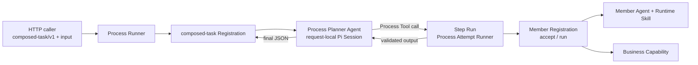

# 在固定 Process 之上增加受控的 Planner 编排

状态：已接受（2026-08-21 实现）

本文面向考虑为项目增加"动态编排"能力的维护者。它回答一个问题：在不放弃现有信任模型的前提下，怎样让一个 Agent 自由组合多个 Business Process。当前状态以 [`process-runtime-design.md`](../process-runtime-design.md) 与 [`processes/common/composed-task/`](../processes/common/composed-task/) 为准；本文保留取舍背景，并在文末记录实现时与原提案的差异。

## 背景

当前七个 Business Process 都是固定流程：[`src/processes/catalog.ts`](../../src/processes/catalog.ts) 在构造期写死 Registration 集合；每个 `registration.ts` 把步骤顺序写死为 `accept → Agent 编译 → 校验 → 调用一次 Capability → 输出校验`；Runtime Skill 由 `skills.ts` 固定名称、版本和 SHA-256，并作为一段 Prompt 全文注入。海报、CRT 与新闻图片 Agent 没有 Tool；文本 Agent 只有一个 Tool 且必须恰好调用一次。[`CONTEXT.md`](../../CONTEXT.md) 把"通用工作流编排"和"动态 Process Definition"列为当前不做。

这套设计保证了三件事：产品请求只能选择 Process id 与版本；Skill 供应链在发布前闭合；每次执行都经过同一套超时、取消、错误净化、幂等键和活动日志治理。直接让模型自由挑 Skill、挑模型或调任意 Tool 会同时破坏这三件事。

需求是"注册很多能力，让 Agent 动态组合"。已验证的事实：

- [`ProcessRegistry.list()`](../../src/process-runtime/registry.ts) 已经存在，可稳定枚举本次发布能执行的全部 Registration。
- [`ProcessRegistration`](../../src/process-runtime/registration.ts) 暴露 `inputSchema`、`outputSchema`、`accept` 和 `run`，而 [`src/api/process-catalog.ts`](../../src/api/process-catalog.ts) 已用 `z.toJSONSchema` 从 Registration Schema 推导描述；Tool 参数 Schema 可以同源推导，不必手写第二份。
- [`createProcessAttemptRunner`](../../src/process-runtime/attempt.ts) 接受预分配 `runId` 和外部 `signal`，设计文档明确它"让同步与异步调用方共享同一执行治理"；第三个调用方不需要改它的 Interface。
- [`PiContentAgent`](../../src/processes/content/agent.pi.ts) 已证明 Pi Session 可以在 `noExtensions/noSkills/noContextFiles` 下只挂载 `customTools` 并限制 `tools` 列表。
- `PROCESS_TIMEOUT_MS` 是全 catalog 单一值（生产 240 秒，代码默认 30 秒），Registration 没有自己的超时。
- 自 commit `25a874a` 起，生产装配由每个流程 Module 的 `production.ts` 用 [`defineProductionProcess`](../../src/processes/production.ts) 声明，[`productionCatalog`](../../src/processes/catalog.ts) 是一个静态数组；[`createProductionRuntime`](../../src/app/business-processes.ts) 逐项调用 `build({ environment, pi, skills, positiveInteger })`。`build` 看不到其他 Registration，也没有"跳过本项"的返回值。
- [`createProductionSkillBindings`](../../src/app/runtime-skills.ts) 按 Process id 从 `installedSkills` 派生绑定；新增 Process 的 Skill 不再需要改 Composition Root。
- [`test/production-environment.test.ts`](../../test/production-environment.test.ts) 用 Proxy 记录 `build` 实际读取的变量，要求与 `environment` 声明完全一致，并且每个变量都出现在 `.env.example`、`ops/inspect-async-production-prerequisites.sh` 和 `ops/provision-async-production-environments.sh` 中。

## 决定

### 形状：Process 作为 Tool，Planner 只能组合，不能扩权

新增一个 Business Process `composed-task/v1`。它持有一个 **Process Planner Agent**（下称 Planner），Planner 获得的全部 Tool 是一组 allow-list 的 **Member Process**，每个 Member Process 包装成一个 **Process Tool**。Planner 决定调用哪些 Member、用什么输入、按什么顺序；每次调用都作为一个 **Step Run** 经 Process Attempt Runner 执行，也就是复用 Member Registration 自己的 `accept`、Agent、Capability、输出校验、幂等键和错误净化。

动态的是**组合**；不变的是**能力边界**。产品请求仍然只选 `composed-task/v1` 并提交业务输入，不能选择 Member、Skill、模型或 Tool。



### 新 Module 与 Interface

<!-- markdownlint-disable MD013 -->

| Module | 位置 | Interface | 隐藏的 Implementation |
| --- | --- | --- | --- |
| Member Allow-list | `src/processes/composed/members.ts` | `composedMembers: readonly MemberSpec[]`，`MemberSpec = { process, version, toolName, description, sideEffect: "none" \| "priced" }` | 哪些 Process 可被 Planner 看到、Tool 名称、面向模型的一句话描述、是否产生付费副作用；`production.ts` 的 `members` 声明从它派生 |
| Process Tool Set | `src/processes/composed/tools.ts` | `createProcessToolSet({ members, registry, attemptRunner }): ProcessToolSet`，`ProcessToolSet.bind(context): readonly ToolDefinition[]` | allow-list 与 Member Registry 精确匹配、`inputSchema` 到 JSON Schema 的推导、Step Run 的 `runId` 派生、结果裁剪 |
| Composed Production | `src/processes/composed/production.ts` | `composedProduction = defineProductionProcess({ id, environment, enabled, members, installedSkills, build })` | 从 `context.members` 与启动变量构造 Registration；声明自己读取的四个变量 |
| Step Run Executor | `src/processes/composed/steps.ts` | `runStep({ member, input, stepNumber, parent }): Promise<StepResult>` | `accept` 拒绝映射、Attempt Runner 调用、父 `signal` 传播、步数与付费步数计数、结果记账 |
| Process Planner Agent Port | `src/processes/composed/agent.ts` | `plan({ goal, constraints, tools, signal }): Promise<unknown>` | 流程专属结果约束；生产实现在 `agent.pi.ts` |
| Tool-bearing Structured Session | `src/agent-runtime/tooled.ts` | `PiTooledAgent.run({ prompt, tools, signal }) → { output, modelId?, toolCalls }` | 带 Tool 的请求级 Pi Session、Tool 名称白名单、最大轮数、取消、释放、JSON 解析 |
| Planner Runtime Skill | `.pi/skills/composed-task-planner/SKILL.md` | 固定名称、版本、SHA-256 | 规划纪律：先读 Tool 描述再行动、付费步骤节制、最终输出格式 |
| Composed Registration | `src/processes/composed/registration.ts` | `createComposedRegistration({ agent, toolSet, limits })` | Schema、活动、预算、失败映射、输出收敛 |

<!-- markdownlint-enable MD013 -->

`PiTooledAgent` 与现有 [`PiStructuredAgent`](../../src/agent-runtime/structured.ts) 并列：前者带 Tool，后者无 Tool。[`PiContentAgent`](../../src/processes/content/agent.pi.ts) 是它的第二个潜在调用方，后续可迁移到同一 Session Module 上；这满足"先有两个 Adapter 再设 Seam"的要求。

### 产品契约

输入（`accept` 校验，≤ 262144 bytes）：

```json
{
  "goal": "把这段产品介绍精简后做一张极简 zine 海报，再输出 CRT 风格版本",
  "material": { "content": "……原文……" },
  "constraints": { "maxSteps": 4 }
}
```

- `goal`：1–4000 字符，自然语言目标。
- `material`：可选，只允许字符串与 HTTPS URL 值的一层对象，每个值 ≤ 12000 字符；这是 Planner 能转交给 Member 的全部业务素材。
- `constraints.maxSteps`：可选，1–6，且不能超过服务端上限。调用方只能收紧，不能放宽。

输出（`outputSchema` 校验，≤ 262144 bytes）：

```json
{
  "summary": "先优化文案，再生成海报，最后生成 CRT 版本。",
  "steps": [
    {
      "step": 1,
      "process": "content-processing",
      "version": "v1",
      "status": "succeeded",
      "output": { "content": "……" }
    },
    {
      "step": 2,
      "process": "minimal-zine-poster",
      "version": "v1",
      "status": "succeeded",
      "output": { "prompt": "……", "recipe": {}, "interpretation": "……", "image": {} }
    }
  ],
  "result": { "image": {} }
}
```

- `steps` 按执行顺序列出全部 Step Run，包括失败的；`output` 是 Member Registration 已校验的公开输出，失败时换成 `error: { code, message }`。
- `result` 由 Planner 指定，但 Registration 要求它只能引用 `steps` 中已成功输出的 JSON 子树；Planner 不能捏造一个没有 Step 产出的结果。这与 `content-processing/v1` "输出必须与 Tool 结果一致"的 invariant 同源。

### 执行顺序与 invariant

1. `accept` 解析输入，计算本次预算：`maxSteps = min(input.constraints.maxSteps, limits.maxSteps)`，`maxPricedSteps = limits.maxPricedSteps`。
2. Registration 在活动 `planner_session` 内启动一次请求级 Pi Session。系统提示只包含固定指令、Planner Runtime Skill 正文和每个 Process Tool 的描述；不含其他 Runtime Skill、文件或扩展。
3. Planner 每次调用 Process Tool，Tool Set 执行一个 Step Run：
   - Tool 名称必须精确命中 allow-list；Pi 层的 `tools` 列表与 `customTools` 同为这组名称，Planner 看不到任何内置 Tool。
   - Step Run 的 `runId` 派生为 `${parentRunId}.${stepNumber}`，并成为 Member Capability 的幂等键。同一父 Run 的第二次 Attempt 重放同样步骤时，下游会拿到同样的键。
   - 每个 Step Run 包在父活动 `process_step` 内，经 Process Attempt Runner 执行，`attempt.signal` 传父 `context.signal`；父超时或取消会终止正在执行的 Step。
   - Member 的 `accept` 拒绝输入时，Tool 返回结构化错误 `{ code: "INVALID_INPUT" }` 给 Planner，让它修正后重试；这不消耗付费步数，但消耗总步数。
   - Step 结果按 Member `outputSchema` 已校验，Tool 只把该 JSON 原样返回，不附加 Prompt、模型消息或内部错误。
4. 超过 `maxSteps` 后，Tool 调用直接返回 `{ code: "STEP_BUDGET_EXHAUSTED" }`；超过 `maxPricedSteps` 后，`sideEffect: "priced"` 的 Tool 返回 `{ code: "PRICED_BUDGET_EXHAUSTED" }`。Planner 必须收尾。
5. Planner 以纯文本 JSON 结束。Registration 校验 `summary/steps/result`，并比对 `steps` 与 Tool Set 记账的 Step Run 一致（数量、顺序、identity、status）；不一致按 `AGENT_FAILURE`。
6. 活动日志只含 `planner_session`、`process_step` 两类父活动；Step Run 自己的活动（如 `poster_rendering`）以派生 `runId` 进入同一 Sink，日志平台按 `runId` 前缀还原父子关系。父日志不记录 `goal`、Tool 参数或任何输出。

`composed-task/v1` 不能是自己的 Member：Tool Set 构造时拒绝 identity 等于自身的 Registration，因此组合深度固定为 1。

### 错误归属

<!-- markdownlint-disable MD013 -->

| 情形 | 结果 | 规则 |
| --- | --- | --- |
| Planner 输出无法解析、引用不存在的 Step、`result` 含未产出内容 | `AGENT_FAILURE` | 与现有 Agent 失败同义；不重试 |
| 全部 Step 失败或 Planner 未调用任何 Tool 就收尾 | `AGENT_FAILURE` | 空编排不算成功 |
| 有付费 Step 已成功，之后 Planner 失败、超时或被取消 | `DEPENDENCY_FAILURE_AFTER_COMMIT` | 已有扣费副作用，必须交给人处理；Attempt Runner 的超时会先于 Registration 命中，因此 Registration 须在活动结束钩子中记录"已提交"标志，由 Planner 自己的 `signal` 监听提前返回该失败 |
| 无付费 Step 成功、Member 依赖不可用导致收尾失败 | `DEPENDENCY_FAILURE` | 可按 retryPolicy 重试 |
| 部分 Step 失败但 Planner 合理收尾 | `succeeded`，`steps` 中标注失败项 | 失败是输出的一部分，不是 Process 失败 |

<!-- markdownlint-enable MD013 -->

`composed-task/v1` 的 `retryPolicy` 固定为不重试。Member 自己的重试策略在 Step Run 内不生效：Attempt Runner 只执行单次 Attempt，重试决策留给 Planner 在预算内显式再调一次。

### 配置

<!-- markdownlint-disable MD013 -->

| 变量 | 默认 | 含义 |
| --- | --- | --- |
| `COMPOSED_TASK_ENABLED` | `false` | 未启用时 catalog 不注册该 Process；启用才校验 Planner Skill |
| `COMPOSED_TASK_MAX_STEPS` | `6` | 服务端步数上限，1–8 |
| `COMPOSED_TASK_MAX_PRICED_STEPS` | `2` | 单次 Run 允许的付费 Step 数，0–4 |
| `COMPOSED_TASK_TIMEOUT_MS` | 见下 | 该 Process 专属超时 |
| `PI_COMPOSED_SKILL_DIRECTORY` | `.pi/skills/composed-task-planner` | Planner Runtime Skill 的路径覆盖，与其他 `PI_*_SKILL_DIRECTORY` 同形 |

<!-- markdownlint-enable MD013 -->

### 生产装配契约的扩展

`composed-task/v1` 是第一个依赖其他 Registration 的 Process，也是第一个需要按环境开关的 Process。[`ProductionProcess`](../../src/processes/production.ts) 提案增加两个可选字段，默认行为与现有七项完全一致：

<!-- markdownlint-disable MD013 -->

| 字段 | 类型 | 语义 |
| --- | --- | --- |
| `members` | `readonly ProcessIdentity[]`，默认空 | 本 Process 的 `build` 需要哪些已构造的 Registration。Composition Root 先构造全部不声明 `members` 的项，再构造声明了 `members` 的项，并把精确匹配的 Member Registry 放进 `context.members`；引用自身、引用未列入 catalog 的 identity、引用另一个带 `members` 的项或引用被 `enabled` 关闭的项都在启动时抛错。组合深度因此固定为 1 |
| `enabled` | `(environment) => boolean`，默认恒真 | 为假时该项不进入 Registry，`installedSkills` 也不参与启动与部署预检校验；`environment` 守卫测试仍对它的 `build` 做一次读取一致性检查 |

<!-- markdownlint-enable MD013 -->

`ProductionContext` 相应增加 `members: ProcessRegistry`（不声明 `members` 的项拿到空 Registry）。[`createProductionRuntime`](../../src/app/business-processes.ts) 从一次 `map` 变为两阶段构建，[`createProductionSkillBindings`](../../src/app/runtime-skills.ts) 在派生安装集合前先按 `enabled` 过滤；两处都不新增任何 Process 专属字段，符合"Composition Root 不再为单个 Process 增加字段"的现行规则。

`composed/production.ts` 的形状：

```ts
export const composedProduction = defineProductionProcess({
    id: "composed-task",
    environment: [
        "COMPOSED_TASK_ENABLED",
        "COMPOSED_TASK_MAX_STEPS",
        "COMPOSED_TASK_MAX_PRICED_STEPS",
        "COMPOSED_TASK_TIMEOUT_MS",
        "PI_COMPOSED_SKILL_DIRECTORY",
    ],
    enabled: (environment) => environment.COMPOSED_TASK_ENABLED === "true",
    members: composedMembers.map(({ process, version }) => ({ id: process, version })),
    installedSkills: (environment) =>
        createComposedSkillRefs({ path: environment.PI_COMPOSED_SKILL_DIRECTORY }),
    build: ({ environment, pi, skills, members, positiveInteger }) =>
        createComposedRegistration({
            agent: new PiComposedAgent({ skills, ...pi }),
            toolSet: createProcessToolSet({ members: composedMembers, registry: members, attemptRunner }),
            limits: { /* 从 positiveInteger 读取 */ },
        }),
});
```

五个变量都要同步写入 `.env.example` 和两个 `ops/*.sh` 清单，否则 `production-environment` 测试会在第一次运行时失败；这是既有门禁，不是本提案新增的要求。

### 必须同时改动的 Runtime

这三项是跨 Module 的，也是本决定需要记录的主要原因：

1. **Registration 级超时。** 一次编排可能串行两三个图片 Process，各 Member 在生产已按 240 秒全局超时运行；父 Run 用同一个值必然不够。提案在 `defineProcessRegistration` 增加可选 `timeoutMs`，Attempt Runner 用 `registration.timeoutMs ?? processTimeoutMs`；上限由 Composition Root 校验，异步 Worker 的租约时长同样要大于该值。这是对所有 Process 可见的 Interface 变化，但默认行为不变。
2. **Attempt Runner 作为第三个调用方。** 不改 Interface，但设计文档与 `CONTEXT.md` 要把 "Process Planner" 写进调用方列表，并说明 Step Run 的派生 `runId` 不是外部可查询的 Process Run，也不写 Run Record。
3. **`ProductionProcess` 的 `members` 与 `enabled`。** 见上一节。它让 catalog 从"平铺数组"变成"最多两层的显式依赖"，Composition Root 的两阶段构建是所有 Process 共用的行为。

不需要改动：Process Registry、Process Runner、HTTP Adapter、异步 Store 与 Queue。

### 与现有约束的关系

- [`CONTEXT.md`](../../CONTEXT.md) 的"当前不做：通用工作流编排"需要改写为"不提供调用方定义的工作流；服务端提供 allow-list Process 的受控编排"。其余边界（无 Shell、无文件、无跨请求记忆、调用方不能选 Skill/模型/Tool）全部保留。
- [`integrating-runtime-skills.md`](../integrating-runtime-skills.md) 的"线上边界"五条禁止模式一条都不触碰：Skill 仍随应用发布，Planner 自己的 Skill 也走 Installed Skill Catalog 精确校验。
- "注册更多能力"的路径不变：按 [`development.md` 的"新增 Business Process"](../development.md#新增-business-process) 加一个 Process（含它自己的 `production.ts`），再在 `members.ts` 加一行。Planner 的能力目录就是 production catalog 的一个子集，`members` 声明让这个子集在启动时可校验。

### 测试面

- `test/composed-process.test.ts`：注入脚本化 Planner（固定 Tool 调用序列）与内存 Member，验证 allow-list 拒绝未知 Tool、自引用拒绝、`maxSteps`/`maxPricedSteps` 耗尽、派生 `runId` 作为 Member 幂等键、父取消传播到 Step、`accept` 拒绝回传给 Planner、`steps` 记账一致性、`result` 引用校验、五种错误映射、输出 ≤ 262144 bytes。
- `test/agent-runtime.test.ts` 增加 `PiTooledAgent`：Tool 白名单、最大轮数、取消与释放、JSON 解析；使用注入的 Session factory，不调真实模型。
- `test/execute-process.test.ts` 增加经 `POST /execute` 的一条成功路径与一条 `DEPENDENCY_FAILURE_AFTER_COMMIT` 路径。
- `test/startup-construction.test.ts`：`COMPOSED_TASK_ENABLED` 关闭时 Registry 不含该 Process 且不校验 Planner Skill；开启时缺 Planner Skill 会 fail-fast；`members` 引用自身、未列入 catalog 或被关闭的项都在启动时抛错。
- `test/production-environment.test.ts` 无需改动即覆盖新 Process 的变量声明、`.env.example` 与 `ops/` 清单；但它的 `build` 调用要补 `members: createProcessRegistry([])` 或按声明构造的 Member Registry。
- 真实模型验证在 [`experiments.md`](../experiments.md) 新增显式命令；它会触发付费图片生成，默认不运行。

### 实施顺序

1. `process-runtime`：`timeoutMs` 可选字段与 Attempt Runner 取值，补设计文档与测试。
2. `processes/production.ts` 与 `app/`：`members`、`enabled`、`context.members`、两阶段构建与 `enabled` 过滤；现有七项行为不变，`production-environment` 测试的 `build` 调用补 `members`。
3. `agent-runtime/tooled.ts`：`PiTooledAgent`，先不迁移 `PiContentAgent`。
4. `processes/composed/`：`members.ts` → `tools.ts` → `steps.ts` → `agent.ts`/`agent.pi.ts` → `registration.ts`，每层先写确定性测试。
5. `.pi/skills/composed-task-planner/`：SKILL.md、SOURCE.md，固定 SHA-256 进 `composed/skills.ts`；绑定由 `installedSkills` 自动派生。
6. `composed/production.ts` 加入 `productionCatalog`；五个变量写入 `.env.example` 与两个 `ops/*.sh` 清单。
7. 文档：`api.md`、`CONTEXT.md`、`processes/common/composed-task/README.md`、`process-runtime-design.md`、`development.md` 的"新增 Business Process"第 5 步、`experiments.md`、Runbook 的超时与租约说明。

## 后果

获得：

- **Leverage**：一个 Registration 让七个既有 Process 都变成可组合能力，而每个能力的校验、幂等、错误净化和 Skill 供应链一行不改。
- **Locality**：Planner 能看到什么、花多少钱、最多走几步，全部集中在 `src/processes/composed/`；新增能力仍走原有 authoring 路径。
- 活动日志与派生 `runId` 让每个 Step 可追溯，而父 Run 仍然是调用方唯一的寻址单位。

代价与约束：

- 一次请求可能触发多次付费图片生成。`maxPricedSteps` 与 feature flag 默认关闭是发布门禁，不是可选项；开放前要有按 caller 的配额。
- 编排结果不再是确定性的：同样输入，Planner 可能选不同 Member 序列。业务验收只能断言 `steps` 记账与 `result` 引用一致，不能断言具体步骤。
- Step Run 的 Member 重试策略被绕过；需要重试的场景由 Planner 在预算内显式重调。
- Registration 级超时一旦引入，异步 Worker 租约、网关超时和 Runbook 都要按最大值重新核对。

## 实现与提案的差异

- `context.members` 的形状定为 `{ registry: ProcessRegistry; attemptRunner: ProcessAttemptRunner }`（`ProductionMembers`），由 Composition Root 用共享 Sink 与默认超时构造；Step Run 的活动日志因此与父 Run 进入同一 Pino Sink。提案中的 `MemberExecutor.runStep` 没有单独出现，`ProcessAttemptRunner.run` 就是那个入口。
- Planner 只回传 `{ summary, result }`；`steps` 由 Registration 的 Step 记账生成，不再要求模型回传并比对。`result` 的来源校验保留。
- 带 Tool 的 Session 落在 `src/agent-runtime/tooled.ts`，与 `structured.ts` 共享新的 `session.ts`；`PiContentAgent` 尚未迁移。
- 新增 `PI_COMPOSED_SKILL_DIRECTORY`，与其他 Skill 路径覆盖同形；五个变量都已进入 `.env.example` 与 `ops/` 清单。
- `ProcessRegistration.timeoutMs` 上限定为 3600000 毫秒；异步 Worker 的租约校验改为对照 catalog 中最长的 Registration 超时。
- 真实模型路径尚无脚本化验证，见 [`experiments.md`](../experiments.md)。
