# Process Runtime 设计

本文面向修改 Process Runtime 的开发者，记录 Business Processing 的当前 Module 设计。领域词汇以
[`CONTEXT.md`](../CONTEXT.md) 为准；文档分类与维护要求见
[`docs/README.md`](README.md)。代码与本文冲突时，以代码和测试为准，并在同一改动中修正文档。

## 设计目标

Process Runtime 在不暴露具体 Business Process 依赖和策略的前提下，统一治理一次执行。
它必须提供以下性质：

- 调用方只提交 Business Process 标识、明确版本和业务输入。
- Process author 在一个 Registration factory 中绑定 Schema、Process Definition、获准依赖和稳定策略。
- Process Registry 在启动时形成不可变 catalog，只做精确版本查找。
- Process Runner 统一生成 `runId`、接受输入并写入 best-effort Run Records；Process Attempt Runner 用预分配的 `runId` 管理超时、取消、公共结果和结构化活动日志。
- Startup Construction 从只读环境变量映射生成 ready Application 和端口，并隐藏配置翻译、默认值、跨字段校验和生产组装。
- Application 只管理 HTTP 生命周期，不知道具体 Business Process。
- `src/bin/api.ts` 只监听端口、记录启动、处理关闭信号和设置退出状态。

## Module 地图

```mermaid
flowchart LR
    Env["Readonly environment"] --> Startup["Startup Construction<br/>constructProcessingService(environment)"]
    Startup --> Application["Processing Application<br/>HTTP lifecycle"]
    Startup --> Executor
    Caller["HTTP caller"] --> Http["HTTP Adapter<br/>transport validation"]
    Application --> Http
    Http --> Executor["Process Executor Interface<br/>execute(request)"]
    Executor --> Runner["Process Runner<br/>run governance"]
    Runner --> Registry["Process Registry<br/>exact lookup"]
    Runner --> Attempt["Process Attempt Runner<br/>run accepted input"]
    Attempt --> Logs["Process Run Activity Logging<br/>content-free timeline"]
    Logs --> Pino["Pino Adapter<br/>newline-delimited JSON stdout"]
    Registry --> Registration["Process Registration<br/>accept / run"]
    Attempt --> Registration
    Registration --> Definition["Process Definition<br/>business behavior"]
    Definition --> Capability["Business Capability Adapter"]
    Definition --> Agent["Restricted Agent<br/>request-local Session"]
    Agent --> Skills["Runtime Skill Set<br/>exact local refs"]
    Agent -->|"content Tool only"| Capability
    Runner --> Records["Process Run Records<br/>best-effort recording"]
```

`constructProcessingService` 是生产启动的唯一 Construction Seam。调用方只提供环境变量映射，
并收到 ready `ProcessingApplication` 和端口；调用方无需知道具体 Adapter、Agent Runtime、
Process catalog 或 HTTP 限制。Construction Root 先用共享的纯函数聚合该角色全部缺失变量，
再解析值、检查跨字段约束并创建 Adapter。独立部署预检命令复用同一缺失项检查，但不构造
Application 或连接外部依赖。

`ProcessExecutor` 是 HTTP Adapter 与 Process Runtime 之间的主 Seam。Process Runner 的
Implementation 位于该 Seam 之后，因此 HTTP Adapter 无需了解 Registry、Registration、
Schema、依赖或策略。

`ProcessRegistration` 是 Process author 使用的 Seam。它暴露固定 identity，以及原子的
`accept` 和 `run`。`accept` 只生成可持久化 accepted input；`run` 执行该快照。Schema、
Process Definition、依赖、策略和输出验证都留在 Module 内。生产同步执行仍只从
`ProcessExecutor` 进入；直接调用 Registration 只用于内部异步 Module 与 Interface 测试，
不是产品入口。

## Interface 与职责

<!-- markdownlint-disable MD013 -->

| Module | Interface | 隐藏的 Implementation |
| --- | --- | --- |
| Startup Construction | `constructProcessingService(environment)` | 按角色聚合缺失变量、配置翻译、默认值、跨字段校验、Adapter 选择、Executor 与 Application 组装 |
| Processing Application | `createProcessingApplication({ executor, http })` | Node HTTP server 的创建、监听和关闭 |
| Process Executor | `execute(request): Promise<ProcessRunResult>` | envelope 校验、查找、超时、取消、失败映射和记录 |
| Process Registration | `identity`、`accept(input)` 与 `run(acceptedInput, context)` | 单次输入解析、JSON-safe 快照、Process Definition、依赖、策略和输出验证 |
| Process Registry | `find({ id, version })` | nominal 校验、重复检测、输入集合复制和二级 Map |
| Process Attempt Runner | `run({ runId, registration, acceptedInput, attemptNumber? })` | 总超时、AbortSignal、公共结果、错误净化和活动日志 |
| Process Run Activity Logging | `runActivity(name, operation)` 与 `ProcessRunLogSink` | 活动声明检查、Attempt 关联、单调顺序、耗时、结果净化和 best-effort 输出 |
| Process Run Log Adapter | `ProcessRunLogSink` | Pino 阈值、严重度映射、敏感字段兜底移除、静态关联字段和单行 JSON stdout |
| Runtime Skill Set | `createSkillSet(refs, cwd)`、`load()` | 非空与重名校验、准确名称解析、顺序、首次读取、缓存和 Prompt 编译 |
| Content Processing Capability | `process(input, { signal })` | 远程协议、超时、响应校验和依赖错误转换 |
| Poster Rendering Capability | `render({ prompt, aspectRatio: "3:5" }, { signal, idempotencyKey })` | 图片生成、持久化、URL 生命周期、远程协议和依赖错误转换 |
| CRT Rendering Capability | `transform({ sourceImageUrl, prompt, palette, aspectRatio }, { signal, idempotencyKey })` | FAL 公网 URL 参考图编辑、确定性后处理、服务端证据策略、持久化、URL 生命周期和依赖错误转换 |
| Process Run Records | `record(completion)` 与 `find(runId)` | 内容保留策略、防御性复制、容量和存储 Adapter |

<!-- markdownlint-enable MD013 -->

这些 Interface 包含类型之外的约束。调用方还必须知道启动校验、调用顺序、错误归属和
内容保留规则；后续修改不能只比较 TypeScript 类型。

## 执行顺序与 invariant

1. HTTP Adapter 处理 media type、请求体大小和并发准入，然后把未知 JSON 交给
   `ProcessExecutor`。
2. Process Runner 在解析外层 envelope 前生成 `runId`。
3. Process Runner 严格校验 `{ process, version, input }`，再让 Process Registry 精确查找
   `(id, version)`。Registry 不选择默认版本、`latest` 或回退版本。
4. Process Registration 的 `accept` 同步解析业务输入一次。Schema transform 也只执行一次。
   accepted input 绑定准确 Process/version 和 schema version，是深度冻结的 JSON-safe snapshot。
   业务 input payload 最多 262144 UTF-8 bytes，序列化 Process identity 最多 4096 bytes，完整
   snapshot 因此最多 266267 bytes。
5. rejected 结果不会生成 accepted input、启动 Process Definition，或把业务输入交给 Process
   Run Records。
6. Process Runner 把自己的 `runId`、准确 Registration 和 accepted input 交给 Process Attempt
   Runner。同步执行使用 Attempt 1；异步 Worker 传入持久化 Attempt number。Attempt Runner 创建
   `AbortSignal`，输出 `process_run_attempt_started`，并用总超时与执行竞争。
7. Registration 的 `run` 重新检查快照版本和 Process identity，但不重新运行输入 Schema；随后
   执行 Definition。Definition 只能调用 Registration 预先声明的 `runActivity(name, operation)`；
   每次调用输出 activity start/finish、结果和耗时。Registration 再把通过输出 Schema 的值收敛为
   最大 262144 UTF-8 bytes 的 JSON-safe snapshot。无法可靠持久化或通过 HTTP 表达的值按无效输出处理。
8. Process Attempt Runner 构造唯一的公共 `ProcessRunResult`，再输出 Attempt finish、稳定错误码和
   总耗时。Process Runner 最后执行 best-effort Run Record；记录语义仍使用原始 accepted request。

Registration 会捕获 Definition 的 Schema 与执行函数，Registry 会复制源数组的成员，Runner
会捕获创建时的 Registry。调用者随后重新赋值这些源属性，不会改变已经组装的运行实例。

## 错误归属

<!-- markdownlint-disable MD013 -->

| 归属 | 错误 | 规则 |
| --- | --- | --- |
| HTTP Adapter | `UNSUPPORTED_MEDIA_TYPE`、`REQUEST_TOO_LARGE`、`SERVICE_BUSY` | 在进入 Process Executor 前拒绝请求 |
| Process Runner | `INVALID_INPUT`、`PROCESS_NOT_FOUND` | 校验 envelope、精确查找和输入接受 |
| Process Attempt Runner | `PROCESS_TIMEOUT`、`INTERNAL_ERROR` | 统一治理 Attempt，并净化超时、异常和无效快照 |
| Process Registration | `INVALID_OUTPUT` | 输出 Schema 拒绝成功值，或成功值不是受限 JSON-safe snapshot 时产生 |
| Process Definition | `AGENT_FAILURE`、`DEPENDENCY_FAILURE` | 只能通过 `failProcess` 返回预期失败值 |

<!-- markdownlint-enable MD013 -->

Process Definition 抛出的异常属于意外失败。Process Attempt Runner 将其转换为不包含内部消息的
`INTERNAL_ERROR`。Content Processing Adapter 把已知传输失败转换为
`ContentProcessingUnavailable`，Registration 再把依赖或 Agent Runtime 失败转换为明确的
领域失败。任何路径都不能把凭证、远端响应或模型错误暴露给调用方。

## Run Records 的内容语义

<!-- markdownlint-disable MD013 -->

| 结果 | 是否提供 accepted input |
| --- | --- |
| envelope 无效 | 否 |
| Process 不存在 | 否 |
| 业务输入被 Registration 拒绝 | 否 |
| 成功 | 是 |
| 预期失败 | 是 |
| 输出无效 | 是 |
| 意外异常 | 是 |
| 超时 | 是 |

<!-- markdownlint-enable MD013 -->

`record` 是 best-effort 操作。同步异常或异步拒绝都不能改变 Process Run Result。默认内容策略
省略业务输入和输出；显式启用内容保留后，也只保存 accepted input 和经过验证的成功输出。

## 运行活动日志

Process Run Activity Logging 位于 Process Attempt Runner Seam。同步 `/execute` 和异步 Worker 使用同一份 `ProcessRunLogRecord` schema；每个 Attempt 从 `sequence: 1` 开始，日志平台按 `runId + attemptNumber + sequence` 还原时间线。固定事件为 Attempt started、activity started、activity finished 和 Attempt finished。finish 记录只包含净化后的 outcome、耗时和可选公开错误码。

Production Composition Root 把 `ProcessRunLogSink` 绑定到同一个 Pino Adapter。Adapter 输出 newline-delimited JSON，并添加 Pino `level`、`pid`、`hostname`、`service`、`module` 和 `msg`；事件自己的 ISO `timestamp` 是唯一时间字段。started 与成功 finish 使用 `info`，失败或取消的 activity 及预期失败、超时或取消的 Attempt 使用 `warn`，以 `INTERNAL_ERROR` 结束的失败 Attempt 使用 `error`。`PROCESS_RUN_LOG_LEVEL` 默认 `info`，也接受 `fatal|error|warn|debug|trace|silent`。

Process author 必须在 `defineProcessRegistration` 中声明最多 32 个固定 activity 名，并使用小写 snake case；Registration 拒绝未声明、重复或不安全的名称。`runActivity` 包住一个有业务意义的操作，自动记录开始、成功、失败或取消。日志 sink 和时钟是 best-effort 依赖：抛错、不可用或写入失败都不能改变操作、Process Result 或持久化状态。

Activity Log 只允许 `runId`、Process identity、Attempt、固定 activity、顺序、时间、结果、耗时和稳定公开错误码。它不接收 accepted input、output、Prompt、Tool 参数、模型消息、隐藏推理、Secret、远端正文或内部异常消息。Pino Adapter 还移除一组常见敏感字段名，作为类型化 record 之外的兜底保护；该配置不能替代源头的字段白名单。Activity Log 不是 Process Event 或 Run Record，不参与查询、恢复、Webhook、重试或状态转换。

## Composition 与依赖

[`constructProcessingService`](../src/app/api.ts) 拥有 API 的生产 Composition Root。
它先校验通用配置，创建 Pino Process Run Log Adapter，再组装四个精确 Registration。`CONTENT_PROCESSING_MODE` 只在文本流程中
选择 `direct` 或 `agent`；海报与 CRT 流程始终构造无 Tool Agent。共享的 provider/model 与 OpenAI API
mode 在启动时成组校验，Skill 文件和外部依赖保持惰性，不影响 liveness。配置错误会在
Application 监听端口前抛出。

Async Process Runs 默认关闭。显式启用时，Construction Root 复用同一个 production Registry，
组装 PostgreSQL Store、`submit/find` Module、可信 caller identity Resolver 和 readiness，并由
Application 在关闭 HTTP server 后释放 Pool。数据库 migration 由部署步骤完成，启动过程不会
隐式修改 schema。`src/app/` 中的独立 Async Role Construction 分别组装 Dispatcher 与 Worker：Dispatcher
只连接 PostgreSQL/Redis，Worker 复用同一 production Registry 并连接执行所需 Business
Capability。独立 Webhook Construction 只组装 Delivery Store、Webhook Outbox、专用 Queue 和
HTTP Sender，不加载 Business Process。四个角色的 liveness 不访问下游，readiness 只检查本角色依赖；生产观测和发布门禁
完成前，异步 feature flag 只用于受控内部环境。

`src/process-runtime/` 独立拥有通用 Process 执行治理，`src/agent-runtime/` 独立拥有跨流程 Agent 基础设施；`src/processes/` 只拥有具体 Business Process 与显式 catalog。具体 Process 可以依赖两个 Runtime Module，Runtime Module 不反向知道任何具体 Process。`api` 与 `process-runs` 只跨 `process-runtime` 的稳定 Interface 执行或持久化流程。

依赖方向是 `bin → app`，再由 `app` 组装 `api`、`processes`、`process-runs` 和 `webhooks`；业务 Module 不反向引用启动层。
`src/bin/` 中的入口只把 `process.env` 传给各自 Construction Seam，然后监听端口、写启动日志并处理
`SIGINT` 和 `SIGTERM`。入口不翻译配置，也不直接组装 Adapter、Executor 或 Application。

Production catalog 由
[`createProcessExecutor`](../src/processes/catalog.ts)
定义，也是唯一知道全部具体 Business Process 的位置。生产 Composition Root 向它提供四组
依赖；它创建四个 Registration、不可变 Registry 和 Process Runner，再向 Application 返回 ready
`ProcessExecutor`。测试和 smoke 可以省略图片流程依赖以构造更小的隔离 catalog，生产组装始终提供。

每个 Registration factory 只捕获该流程获准使用的依赖：

- `content-processing/v1` 捕获 Content Processing Capability、可选 Agent 和 `mode`。流程 Module 的 `skills.ts` 拥有两个准确 Runtime Skill 的名称、顺序、默认路径和唯一 Tool 名称；Composition Root 只提供路径覆盖、模型和供应商等部署配置。Pi Adapter 只加载该集合，不扫描或启用其他 Skill。路径在构造时固定；空集合或重复引用会阻止构造。文件在首次 Agent 请求时读取并缓存，缺失、重复解析或空正文会映射为 `AGENT_FAILURE`。Registration 最多让一次 Agent Tool 调用触达 Business Capability，始终使用 `runId` 作为下游幂等键，并只接受与该 Tool 结果一致的 Agent 输出。
- `titled-content-processing/v1` 捕获 Content Processing Capability 和 `separator`。
- `minimal-zine-poster/v1` 捕获 Poster Agent 与 Poster Rendering Capability。Agent 只加载 `minimal-zine-poster-prompt`，不获得 Tool；Registration 要求四段 Prompt、六个固定 recipe 轴和可选原文逐字保留。验证通过后，Registration 只调用一次 Capability，并以 `runId` 作为下游幂等键。Capability 必须返回 HTTP(S) 图片 URL、受限媒体类型、尺寸和可选过期时间；原始图片字节不进入 Process output。
- `crt-interface-image/v1` 捕获 CRT Agent 与 CRT Rendering Capability。产品只提交公网 HTTPS `sourceImageUrl`、固定调色板和画幅；Agent 只加载 `tait-crt-interface-prompt`，不获得 Tool，也看不到参考图 URL。Registration 要求四段 Prompt、十四个固定 recipe 轴、请求画幅、准确调色板和核心 CRT 约束；验证通过后只调用一次 Capability，并以 `runId` 作为下游幂等键。Capability 必须返回符合 GPT Image 2 尺寸边界和请求比例的 PNG 引用；Prompt、recipe、来源 URL 和图片字节不进入 Process output。图片 Business API 在自己的 Composition Root 固定 FAL、证据和存储策略。完整边界见 [`processes/crt-interface-image/`](processes/crt-interface-image/)。
- Execution Context 只携带请求级的 `runId`、`AbortSignal` 与受控 `runActivity`；业务依赖和稳定策略仍由 Registration 捕获。

依赖按 Seam 类型处理：

<!-- markdownlint-disable MD013 -->

| 依赖 | 类别 | Adapter 策略 |
| --- | --- | --- |
| Zod Schema、Registry Map、结果映射 | in-process | 留在深 Module 内，不增加 Adapter |
| 受控 Business API | remote but owned | `ContentProcessingCapability`、`PosterRenderingCapability` 与 `CrtRenderingCapability` port；生产使用 HTTP Adapter，测试使用内存 Adapter |
| Pi Agent Runtime | true external | `agent.ts` 定义窄 Interface；生产使用 `pi.ts` Adapter，测试使用 mock Adapter |
| Runtime Skill 快照 | bundled resource | 流程拥有准确 `SkillRef[]`；`src/agent-runtime/skills.ts` 精确加载，不自动发现或扩大 Tool 权限 |
| Run Record 存储 | 可替换存储 Seam | disabled、内存和持久化 Adapter 共用 `ProcessRunRecordAdapter` |

<!-- markdownlint-enable MD013 -->

## 测试面

Interface 就是测试面：

- Startup Construction 测试传入显式只读环境变量映射，并验证按角色聚合缺失项、默认值、
  配置覆盖、四项 Registration 组装、跨字段拒绝，以及 Skill 与外部依赖在健康检查中保持惰性。
- 大部分产品行为通过真实本地 HTTP 的 `POST /execute` 测试。
- Process Runtime 测试只跨 Registration、Registry、Process Attempt Runner 和 Process
  Executor 的公开 Seam，覆盖接受 invariant、单次解析、延迟执行、精确版本、快照拒绝、失败、
  超时、活动时间线、日志故障隔离和记录语义。Pino Adapter 测试覆盖 JSON 形状、严重度、阈值和敏感字段兜底移除。
- Application 测试注入 fake ready Process Executor，证明 Application 不依赖具体流程。
- 远程依赖测试使用受控 Adapter 或 mock Adapter，不访问真实凭证与远端系统。
- Runtime Skill Set 测试生产绑定、多项顺序、未绑定项隔离、重名拒绝和准确名称解析。
- Agent Registration 测试文本 Tool 的缺失、重复调用和结果来源，也测试海报与 CRT Agent 的结构、请求约束和先验证后渲染。CRT 测试还证明 Agent 看不到资产标识、Capability 只调用一次、图片为受限 PNG 且比例正确。确定性测试不调用真实模型。文本 smoke 验证真实 Tool 路径；海报业务验收从产品 `POST /execute` 经过 production catalog、真实 Agent、production HTTP Adapter、受控 `POST /posters` Capability 和真实图片 URL；CRT 的显式 smoke 当前只验证 GPT Image 2 reference-edit stage。Skill A/B 组合仍由独立命令执行。

测试不读取私有 Map，不断言 key 编码，也不依赖内部 helper 的调用顺序。Implementation
重构只要保持 Interface，就不应迫使这些测试重写。

## 新增 Business Process

Process Registration 是编写一个版本的 authoring Seam：Registration factory 保持 Schema、
Process Definition、获准依赖和稳定策略的 Locality；显式 production catalog 决定该版本是否
可被产品调用。自然语言需求如何收敛为产品契约见
[`authoring-business-processes.md`](authoring-business-processes.md)，准确代码步骤和验证命令见
[`development.md`](development.md#新增-business-process)。

Runtime registration、自动发现、动态 Process Definition 和版本回退不受支持。显式 catalog
增加一个中心编辑点，但它让依赖授权、启动顺序和版本选择保持可见。

## Depth、Leverage 与 Locality

- `defineProcessRegistration` 隐藏单次解析、JSON-safe 快照、类型推断、延迟执行、预期失败标记和输出验证。
- `createProcessRegistry` 隐藏 nominal 校验、重复检测、不可变复制和精确查找。
- `createProcessAttemptRunner` 隐藏预分配 `runId` 的执行治理，让同步与异步调用方共享
  同一结果、超时、取消、错误净化和活动日志语义。
- `createProcessRunner` 隐藏同步 envelope、查找、接受、Attempt 调用和记录顺序。
- `createSkillSet` 隐藏多目录读取、名称去重、准确匹配、顺序和 Prompt 编译。
- Registration factory 把一个流程的 Schema、行为、依赖和策略放在同一文件，形成 Locality。

这些 Module 为调用方提供 Leverage：调用方学习少量 Interface，便能复用完整治理行为。

## Deletion test

- 删除 `defineProcessRegistration`，每个流程都必须重新实现输入接受、可持久化快照、类型收窄、
  预期失败和输出验证。
- 删除 Process Registry，重复检测、不可变 catalog 和精确版本查找会散落到 composition
  或 Process Runner。
- 删除 Process Attempt Runner，同步与异步调用方都必须重新实现预分配 `runId`、超时、取消和
  失败净化，并且每个 Process 都要自行拼接活动关联、顺序、耗时和安全字段。
- 删除 Process Runner，HTTP Adapter 必须重新实现 envelope、查找、接受、Attempt 调用和 Run
  Records 顺序。
- 删除 Runtime Skill Set，Agent Adapter 必须自行处理重名、准确匹配、顺序、文件读取和正文编译。
- 删除显式 production catalog，Application 将重新知道所有具体 Business Process。

删除这些 Module 会让复杂度扩散到多个调用方，因此它们通过 deletion test，并为当前
Interface 提供足够 Depth。
