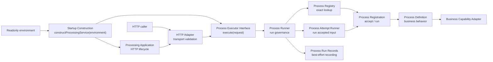

# Process Runtime 设计

本文面向修改 Process Runtime 的开发者，记录 Business Processing 的当前 Module 设计。领域词汇以
[`CONTEXT.md`](../CONTEXT.md) 为准；文档分类与维护要求见
[`docs/README.md`](README.md)。代码与本文冲突时，以代码和测试为准，并在同一改动中修正文档。

## 设计目标

Process Runtime 在不暴露具体 Business Process 依赖和策略的前提下，统一治理一次执行。
它必须提供以下性质：

- 调用方只提交 Business Process 标识、明确版本和业务输入。
- Process author 在一个 Registration factory 中绑定 Schema、Process Definition、获准依赖和稳定策略。
- Process Registry 在启动时形成不可变 catalog，只做精确版本查找。
- Process Runner 统一生成 `runId`、接受输入并写入 best-effort Run Records；Process Attempt Runner 用预分配的 `runId` 管理超时、取消和公共结果。
- Startup Construction 从只读环境变量映射生成 ready Application 和端口，并隐藏配置翻译、默认值、跨字段校验和生产组装。
- Application 只管理 HTTP 生命周期，不知道具体 Business Process。
- `main.ts` 只监听端口、记录启动、处理关闭信号和设置退出状态。

## Module 地图

`constructProcessingService` 是生产启动的唯一 Construction Seam。调用方只提供环境变量映射，
并收到 ready `ProcessingApplication` 和端口；调用方无需知道具体 Adapter、Agent Runtime、
Process catalog 或 HTTP 限制。

`ProcessExecutor` 是 HTTP Adapter 与 Process Runtime 之间的主 Seam。Process Runner 的
Implementation 位于该 Seam 之后，因此 HTTP Adapter 无需了解 Registry、Registration、
Schema、依赖或策略。

`ProcessRegistration` 是 Process author 使用的 Seam。它暴露固定 identity，以及原子的
`accept` 和 `run`。`accept` 只生成可持久化 accepted input；`run` 执行该快照。Schema、
Process Definition、依赖、策略和输出验证都留在 Module 内。生产同步执行仍只从
`ProcessExecutor` 进入；直接调用 Registration 只用于内部异步 Module 与 Interface 测试，
不是产品入口。

## Interface 与职责

<!-- markdownlint-disable MD013 -->

| Module | Interface | 隐藏的 Implementation |
| --- | --- | --- |
| Startup Construction | `constructProcessingService(environment)` | 环境变量翻译、默认值、跨字段校验、Adapter 选择、Executor 与 Application 组装 |
| Processing Application | `createProcessingApplication({ executor, http })` | Node HTTP server 的创建、监听和关闭 |
| Process Executor | `execute(request): Promise<ProcessRunResult>` | envelope 校验、查找、超时、取消、失败映射和记录 |
| Process Registration | `identity`、`accept(input)` 与 `run(acceptedInput, context)` | 单次输入解析、JSON-safe 快照、Process Definition、依赖、策略和输出验证 |
| Process Registry | `find({ id, version })` | nominal 校验、重复检测、输入集合复制和二级 Map |
| Process Attempt Runner | `run({ runId, registration, acceptedInput })` | 总超时、AbortSignal、公共结果和错误净化 |
| Content Processing Capability | `process(input, { signal })` | 远程协议、超时、响应校验和依赖错误转换 |
| Process Run Records | `record(completion)` 与 `find(runId)` | 内容保留策略、防御性复制、容量和存储 Adapter |

<!-- markdownlint-enable MD013 -->

这些 Interface 包含类型之外的约束。调用方还必须知道启动校验、调用顺序、错误归属和
内容保留规则；后续修改不能只比较 TypeScript 类型。

## 执行顺序与 invariant

1. HTTP Adapter 处理 media type、请求体大小和并发准入，然后把未知 JSON 交给
   `ProcessExecutor`。
2. Process Runner 在解析外层 envelope 前生成 `runId`。
3. Process Runner 严格校验 `{ process, version, input }`，再让 Process Registry 精确查找
   `(id, version)`。Registry 不选择默认版本、`latest` 或回退版本。
4. Process Registration 的 `accept` 同步解析业务输入一次。Schema transform 也只执行一次。
   accepted input 绑定准确 Process/version 和 schema version，是深度冻结的 JSON-safe snapshot。
   业务 input payload 最多 262144 UTF-8 bytes，序列化 Process identity 最多 4096 bytes，完整
   snapshot 因此最多 266267 bytes。
5. rejected 结果不会生成 accepted input、启动 Process Definition，或把业务输入交给 Process
   Run Records。
6. Process Runner 把自己的 `runId`、准确 Registration 和 accepted input 交给 Process Attempt
   Runner。Attempt Runner 创建 `AbortSignal` 并用总超时与执行竞争。
7. Registration 的 `run` 重新检查快照版本和 Process identity，但不重新运行输入 Schema；随后
   执行 Definition，并把通过输出 Schema 的值收敛为最大 262144 UTF-8 bytes 的 JSON-safe
   snapshot。无法可靠持久化或通过 HTTP 表达的值按无效输出处理。
8. Process Attempt Runner 构造唯一的公共 `ProcessRunResult`。Process Runner 再执行 best-effort
   记录；记录语义仍使用原始 accepted request。

Registration 会捕获 Definition 的 Schema 与执行函数，Registry 会复制源数组的成员，Runner
会捕获创建时的 Registry。调用者随后重新赋值这些源属性，不会改变已经组装的运行实例。

## 错误归属

<!-- markdownlint-disable MD013 -->

| 归属 | 错误 | 规则 |
| --- | --- | --- |
| HTTP Adapter | `UNSUPPORTED_MEDIA_TYPE`、`REQUEST_TOO_LARGE`、`SERVICE_BUSY` | 在进入 Process Executor 前拒绝请求 |
| Process Runner | `INVALID_INPUT`、`PROCESS_NOT_FOUND` | 校验 envelope、精确查找和输入接受 |
| Process Attempt Runner | `PROCESS_TIMEOUT`、`INTERNAL_ERROR` | 统一治理 Attempt，并净化超时、异常和无效快照 |
| Process Registration | `INVALID_OUTPUT` | 输出 Schema 拒绝成功值，或成功值不是受限 JSON-safe snapshot 时产生 |
| Process Definition | `AGENT_FAILURE`、`DEPENDENCY_FAILURE` | 只能通过 `failProcess` 返回预期失败值 |

<!-- markdownlint-enable MD013 -->

Process Definition 抛出的异常属于意外失败。Process Attempt Runner 将其转换为不包含内部消息的
`INTERNAL_ERROR`。Content Processing Adapter 把已知传输失败转换为
`ContentProcessingUnavailable`，Registration 再把依赖或 Agent Runtime 失败转换为明确的
领域失败。任何路径都不能把凭证、远端响应或模型错误暴露给调用方。

## Run Records 的内容语义

<!-- markdownlint-disable MD013 -->

| 结果 | 是否提供 accepted input |
| --- | --- |
| envelope 无效 | 否 |
| Process 不存在 | 否 |
| 业务输入被 Registration 拒绝 | 否 |
| 成功 | 是 |
| 预期失败 | 是 |
| 输出无效 | 是 |
| 意外异常 | 是 |
| 超时 | 是 |

<!-- markdownlint-enable MD013 -->

`record` 是 best-effort 操作。同步异常或异步拒绝都不能改变 Process Run Result。默认内容策略
省略业务输入和输出；显式启用内容保留后，也只保存 accepted input 和经过验证的成功输出。

## Composition 与依赖

[`constructProcessingService`](../src/startup-construction.ts) 拥有完整的生产 Composition Root。
它先校验通用配置，再选择 `direct` 或 `agent` 路径。Direct 路径忽略 Agent 专用配置；Agent
路径校验成组的 provider/model 和 OpenAI API mode，再构造 Pi Agent Runtime。任何配置错误
都会在 Application 监听端口前抛出。

Async Process Runs 默认关闭。显式启用时，Construction Root 复用同一个 production Registry，
组装 PostgreSQL Store、`submit/find` Module、可信 caller identity Resolver 和 readiness，并由
Application 在关闭 HTTP server 后释放 Pool。数据库 migration 由部署步骤完成，启动过程不会
隐式修改 schema；BullMQ Worker 接入前异步 feature flag 不能用于生产流量。

[`main.ts`](../src/main.ts) 只把 `process.env` 传给 Construction Seam，然后监听端口、写启动
日志并处理 `SIGINT` 和 `SIGTERM`。它不翻译配置，也不直接组装 Adapter、Executor 或
Application。

Production catalog 由
[`createBusinessProcessExecutor`](../src/business-process-executor.ts)
定义，也是唯一知道全部具体 Business Process 的位置。它创建两个 Registration、不可变
Registry 和 Process Runner，再向 Application 返回 ready `ProcessExecutor`。

每个 Registration factory 只捕获该流程获准使用的依赖：

- `content-processing/v1` 捕获 Content Processing Capability、可选 Agent Runtime 和 `mode`。
- `titled-content-processing/v1` 捕获 Content Processing Capability 和 `separator`。
- Execution Context 只携带请求级的 `runId` 与 `AbortSignal`。

依赖按 Seam 类型处理：

<!-- markdownlint-disable MD013 -->

| 依赖 | 类别 | Adapter 策略 |
| --- | --- | --- |
| Zod Schema、Registry Map、结果映射 | in-process | 留在深 Module 内，不增加 Adapter |
| 受控 Business API | remote but owned | `ContentProcessingCapability` port；生产使用 HTTP Adapter，测试使用内存 Adapter |
| Pi Agent Runtime | true external | 注入窄 port；生产使用 Pi Adapter，测试使用 mock Adapter |
| Run Record 存储 | 可替换存储 Seam | disabled、内存和持久化 Adapter 共用 `ProcessRunRecordAdapter` |

<!-- markdownlint-enable MD013 -->

## 测试面

Interface 就是测试面：

- Startup Construction 测试传入显式只读环境变量映射，并通过本地 HTTP 边界验证默认值、
  配置覆盖、Direct/Agent 组装、跨字段拒绝和 Agent 专用配置在 Direct 模式下保持惰性。
- 大部分产品行为通过真实本地 HTTP 的 `POST /execute` 测试。
- Process Runtime 测试只跨 Registration、Registry、Process Attempt Runner 和 Process
  Executor 的公开 Seam，覆盖接受 invariant、单次解析、延迟执行、精确版本、快照拒绝、失败、
  超时和记录语义。
- Application 测试注入 fake ready Process Executor，证明 Application 不依赖具体流程。
- 远程依赖测试使用受控 Adapter 或 mock Adapter，不访问真实凭证与远端系统。
- 确定性测试不调用真实模型；真实 Agent 冒烟和 Skill A/B 组合仍由独立命令执行。

测试不读取私有 Map，不断言 key 编码，也不依赖内部 helper 的调用顺序。Implementation
重构只要保持 Interface，就不应迫使这些测试重写。

## 新增 Business Process

Process Registration 是编写一个版本的 authoring Seam：Registration factory 保持 Schema、
Process Definition、获准依赖和稳定策略的 Locality；显式 production catalog 决定该版本是否
可被产品调用。自然语言需求如何收敛为产品契约见
[`authoring-business-processes.md`](authoring-business-processes.md)，准确代码步骤和验证命令见
[`development.md`](development.md#新增-business-process)。

Runtime registration、自动发现、动态 Process Definition 和版本回退不受支持。显式 catalog
增加一个中心编辑点，但它让依赖授权、启动顺序和版本选择保持可见。

## Depth、Leverage 与 Locality

- `defineProcessRegistration` 隐藏单次解析、JSON-safe 快照、类型推断、延迟执行、预期失败标记和输出验证。
- `createProcessRegistry` 隐藏 nominal 校验、重复检测、不可变复制和精确查找。
- `createProcessAttemptRunner` 隐藏预分配 `runId` 的执行治理，让同步与异步调用方共享
  同一结果、超时、取消和错误净化语义。
- `createProcessRunner` 隐藏同步 envelope、查找、接受、Attempt 调用和记录顺序。
- Registration factory 把一个流程的 Schema、行为、依赖和策略放在同一文件，形成 Locality。

这些 Module 为调用方提供 Leverage：调用方学习少量 Interface，便能复用完整治理行为。

## Deletion test

- 删除 `defineProcessRegistration`，每个流程都必须重新实现输入接受、可持久化快照、类型收窄、
  预期失败和输出验证。
- 删除 Process Registry，重复检测、不可变 catalog 和精确版本查找会散落到 composition
  或 Process Runner。
- 删除 Process Attempt Runner，同步与异步调用方都必须重新实现预分配 `runId`、超时、取消和
  失败净化。
- 删除 Process Runner，HTTP Adapter 必须重新实现 envelope、查找、接受、Attempt 调用和 Run
  Records 顺序。
- 删除显式 production catalog，Application 将重新知道所有具体 Business Process。

删除这些 Module 会让复杂度扩散到多个调用方，因此它们通过 deletion test，并为当前
Interface 提供足够 Depth。
