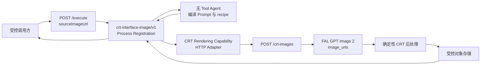

# `crt-interface-image/v1` Business Process

本文面向实现、测试和发布 `crt-interface-image/v1` 的开发者。调用方提供公网图片 URL 后，用 FAL GPT Image 2 生成 TaiT CRT 界面风格图片是可行的。仓库已经实现 Process Registration、受限 Agent、固定 Runtime Skill、CRT Rendering Capability Interface、生产 HTTP Adapter、内部 `POST /crt-images` Business API、确定性 finalizer、FAL URL 编辑和阿里云 OSS 输出。正式开放前仍须配置入口鉴权、生产 Secret，并确认上游 Skill 的使用权。

要开发同类“上传参考图 → 模型编辑 → 确定性后处理 → 图片引用”流程，先阅读 [参考图转换 Business Process 开发模板](development-template.md)。它把本流程已验证的 Module 边界、配置归属、证据策略、测试分层和完成标准整理成可复制步骤。

上游 `TaiT-tt/tait-crt-interface-skill` 没有声明许可证。固定版本、审查结果和适配差异记录在 [Runtime Skill 来源记录](../../../.pi/skills/tait-crt-interface-prompt/SOURCE.md)；发布负责人确认再分发和生产使用权之前，不得把该快照发布到未获授权的环境。

## 当前产品契约

产品调用统一的 `POST /execute`，提交一条 FAL 可匿名读取的公网 HTTPS 图片 URL。`/execute` 不接收图片字节、文件路径、Prompt、模型、Skill、Tool 或存储配置。

```json
{
  "process": "crt-interface-image",
  "version": "v1",
  "input": {
    "sourceImageUrl": "https://images.example.com/source/portrait.png",
    "palette": "经典",
    "aspectRatio": "4:3"
  }
}
```

`sourceImageUrl` 最长 2048 字符，只接受无账号密码、无 fragment、无自定义端口、非 localhost、非 IP literal 的 HTTPS URL。它可以包含 OSS/CDN 签名查询参数，但有效期必须覆盖 FAL 读取时间。调色板只接受 `经典`、`粉黛`、`极客01`、`极客02`、`复古01`、`复古02`、`游戏01`、`游戏02` 或 `如图`；画幅只接受 `3:4`、`4:3`、`9:16` 或 `16:9`。

成功结果不泄露内部 Prompt、recipe、模型或 Skill：

```json
{
  "runId": "123e4567-e89b-42d3-a456-426614174000",
  "process": "crt-interface-image",
  "version": "v1",
  "status": "succeeded",
  "output": {
    "aspectRatio": "4:3",
    "image": {
      "url": "https://assets.example.com/crt/123e4567-e89b-42d3-a456-426614174000.png",
      "contentType": "image/png",
      "width": 1600,
      "height": 1200,
      "expiresAt": "2026-08-10T16:00:00.000Z"
    }
  }
}
```

图片 URL 必须使用 HTTP(S)，不能包含用户名或密码。输出必须是 PNG；宽高都必须是 16 的倍数且不超过 3840，像素总数必须在 655360–8294400 之间，实际比例与所选画幅的误差不得超过 0.015。长期 URL 可以省略 `expiresAt`，短期签名 URL 必须返回它。

## Module 与执行顺序



主线固定为：

1. 调用方准备一条 FAL 可读取且有效期足够的公网 HTTPS 图片 URL。
2. Registration 严格接受三个业务字段，并把调色板和画幅交给无 Tool Agent。Agent 看不到参考图 URL。
3. Agent 从固定的 `tait-crt-interface-prompt` Runtime Skill 编译四段英文 Prompt 和十四轴 recipe。Registration 验证结构、调色板、画幅和核心视觉约束；失败时不调用图片服务。
4. Registration 以 Process `runId` 作为幂等键，只调用一次 CRT Rendering Capability。
5. 受控 Business API 把 URL 原样交给 FAL GPT Image 2，执行同尺寸后处理，把 PNG 保存到配置的存储，并返回图片引用。
6. Registration 验证媒体类型、尺寸和比例后，才向产品返回结果。

运行活动日志用 `crt_prompt_compilation` 和 `crt_rendering` 区分 Agent 编译校验与 CRT Rendering Capability 调用。日志只记录活动结果与耗时，不记录 `sourceImageUrl`、调色板、画幅、Prompt、recipe、图片 URL、资产内容或供应商正文。

GPT Image 2 的官方图片指南明确支持通过 Images API 编辑一张或多张参考图，并支持符合约束的自定义输出尺寸；开发时以 [Edit images](https://developers.openai.com/api/docs/guides/image-generation#edit-images) 和 [Customize image output](https://developers.openai.com/api/docs/guides/image-generation#customize-image-output) 为准。FAL 也提供 [`openai/gpt-image-2/edit`](https://fal.ai/models/openai/gpt-image-2/edit/api)，接受 Data URI、`image_urls`、自定义尺寸、质量和 PNG 输出。模型和供应商配置固定在 Business API 内，不进入产品请求。

## 公网图片 URL 边界

本服务不下载参考图，也不提供上传 endpoint。调用方可以先把图片上传到 OSS、CDN 或现有图片服务，再把公网 HTTPS URL 提交给 `/execute`。FAL 直接读取该 URL，因此来源必须允许 FAL 访问，不能依赖浏览器 Cookie、内网地址或仅本机可见的地址。

- 签名 URL 的有效期必须覆盖排队、Agent 编译和 FAL 下载时间。
- 来源站点若有防盗链、User-Agent、区域或频率限制，必须提前验证 FAL 能读取。
- URL 可能包含临时签名，普通日志、报告和 manifest 只记录 SHA-256，不记录完整 URL。
- 调用方仍须确认其拥有图片、人物肖像、品牌和作品的处理权。
- 当前只做 URL 形状校验；如果将来允许匿名公网调用，还需增加身份、费用、配额和内容安全控制。

## 实现 `POST /crt-images`

生产 Adapter 会调用 `BUSINESS_API_BASE_URL` 下的 `POST /crt-images`：

```http
POST /crt-images HTTP/1.1
Content-Type: application/json
Idempotency-Key: 123e4567-e89b-42d3-a456-426614174000

{
  "sourceImageUrl": "https://images.example.com/source/portrait.png",
  "prompt": "internal reviewed prompt",
  "palette": "经典",
  "aspectRatio": "4:3"
}
```

这是服务间 Interface。产品不能直接调用它，也不能读取其中的 Prompt。实现应按以下顺序处理：

1. 对 `Idempotency-Key` 建立原子 claim。相同 key 的重复请求必须返回同一已完成结果，不能再次付费调用模型。
2. 校验 `sourceImageUrl`，但不下载或记录完整 URL。
3. 按画幅选择固定尺寸，并把 `sourceImageUrl` 原样放入 FAL `openai/gpt-image-2/edit` 的 `image_urls`。当前 v1 的公网 URL 路径只支持 FAL；OpenAI multipart Adapter 仍供本地文件 smoke 使用。
4. 对模型 PNG 执行确定性后处理和输出检查。
5. 按服务端证据策略选择不保存、只保存 manifest，或保存模型原始图、最终图和 manifest；产品请求不能覆盖该策略。
6. 用 `runId` 派生稳定对象键，写入私有或受控分发存储，再保存幂等结果。
7. 返回与产品输出中 `image` 相同的 JSON 结构；不要返回供应商响应、Prompt、内部对象键或凭证。

生产 OSS 配置：

```dotenv
OBJECT_STORAGE_PROVIDER=aliyun-oss
OSS_REGION=oss-cn-hangzhou
OSS_BUCKET=your-bucket
OSS_ACCESS_KEY_ID=your-access-key-id
OSS_ACCESS_KEY_SECRET=your-access-key-secret
OSS_URL_ACCESS=signed
OSS_SIGNED_URL_TTL_SECONDS=3600
OSS_TIMEOUT_MS=60000
CRT_IMAGE_OBJECT_PREFIX=crt-interface-image
```

使用临时凭证时补充 `OSS_STS_TOKEN`。若使用绑定域名，再按实际情况配置 `OSS_ENDPOINT`、`OSS_CNAME=true`；公开/CDN 读取时改为 `OSS_URL_ACCESS=public` 并配置 `OSS_PUBLIC_BASE_URL`。密钥只放部署 Secret，不写入仓库。

建议的固定尺寸如下，全部符合当前 GPT Image 2 自定义尺寸边界：

| 画幅 | 宽 × 高 |
| --- | ---: |
| `3:4` | `1200 × 1600` |
| `4:3` | `1600 × 1200` |
| `9:16` | `1152 × 2048` |
| `16:9` | `2048 × 1152` |

Business API 在调用模型前持久化 `runId`、请求摘要和 pending 状态，成功后原子写入结果；相同 `runId` 重启后也不会再次调用模型。pending 状态表示调用结果未知，服务返回受控失败并等待人工核对，不能自动重试。`crt-interface-image/v1` 本身不声明自动重试。

## 确定性后处理

GPT Image 2 负责识别参考图、保留主体关系和重绘整体构图，但它不能稳定保证精确调色板、像素格、扫描线、桶形畸变或固定签名。Business API 必须在模型编辑后执行同尺寸 finalizer：

- 把图像量化到选定的 2–5 色调色板；`如图` 要先从参考图提取一组有明确明暗端点、去重后的 2–5 色。
- 用一个共享方格统一界面、主体和纹理的像素节奏，不改变输出尺寸。
- 加入受调色板约束的扫描线、少量噪声、边缘错位和外缘桶形畸变，保持中央 80% 稳定。
- 以同一 bitmap grid 锁定右上标题栏中的 `tait-crt-interface-skill` 签名。
- 输出不含 alpha 的 PNG，并重新验证尺寸、比例、调色板和解码完整性。

[`src/business-api/crt-finalizer.ts`](../../../src/business-api/crt-finalizer.ts) 根据上述公开输出约束独立实现 finalizer，没有复制上游 Python 源码。它用 Sharp 完成目标尺寸、调色板量化、共享格、扫描线、边缘扰动、桶形外缘和固定签名。上游 Python 脚本只作为已审查的行为参考，没有随 Runtime Skill 安装。Agent 不能运行 finalizer，也不能获得文件系统、Shell 或通用网络权限。

后处理无法修复主体遗漏、重复、手部关系错误或构图偏差。上线前需要人工或受控视觉验收；若以后加入自动质检与重绘，应发布新版本，明确最大尝试次数、费用、幂等和失败语义。

## 可配置证据保留

图片证据属于 `crt-interface-image/v1` 的服务端运行策略，不属于产品 Interface。CRT Business API 支持三档模式：`off` 不创建调试证据，`metadata` 只保存脱敏 manifest，`full` 按 `runId` 保存 GPT Image 2 原始返回、CRT 最终图和 manifest。`accept:crt-business` 默认使用 `full`；生产 Compose 固定使用 `off`。

`off` 不影响产品最终图片的持久化。证据副本和产品资产使用独立的授权、保留和删除策略。配置、目录结构、manifest 字段、失败语义和开发核对步骤见 [CRT 图片证据保留](evidence-retention.md)。

## 错误契约

| 阶段 | 公开错误 | 条件 |
| --- | --- | --- |
| 输入接受 | `INVALID_INPUT` | 缺少字段、未知调色板或画幅、非法资产标识、额外实现字段 |
| Prompt 编译 | `AGENT_FAILURE` | Agent 调用失败，或 Prompt/recipe 未通过 Registration 校验 |
| 图片依赖 | `DEPENDENCY_FAILURE` | 资产不可用、图片编辑、后处理、启用的证据写入、存储或图片引用解析失败 |
| 输出验证 | `INVALID_OUTPUT` | Capability 返回的图片类型、URL、尺寸或比例不符合契约 |
| 执行治理 | `PROCESS_TIMEOUT` | Process 总超时先于结果完成 |
| 意外异常 | `INTERNAL_ERROR` | 未分类的 Implementation 错误 |

错误响应不得包含资产内部路径、Prompt、供应商正文、API key、bucket、签名 URL 或模型错误详情。运维日志只记录 `runId`、Process identity、阶段、稳定错误码、延迟和经过批准的供应商 request ID。

## 开发与验证

先运行不联网、不产生费用的确定性验证：

```bash
npm test -- test/crt-process.test.ts test/crt-http.test.ts test/runtime-skills.test.ts test/startup-construction.test.ts
npm test -- test/openai-image-generation.test.ts test/fal-image-generation.test.ts test/openai-image-config.test.ts test/image-generation-config.test.ts test/crt-local-business-api.test.ts test/crt-evidence.test.ts
npm run check
npm run typecheck
npm test
npm run build
```

确定性测试证明严格产品 Schema、Agent 先于 Capability、Agent 看不到图片 URL、单次 Capability 调用、`runId` 幂等键、错误净化、图片元数据，以及 FAL 公网 URL 协议。它们不证明真实模型的视觉质量。

显式 GPT Image 2 smoke 会联网、产生模型费用、读取本地参考图并写入 `artifacts/crt-interface-image/`。确认图片不敏感、费用和凭证范围后再运行：

```bash
CRT_SOURCE_IMAGE_FILE=/absolute/path/to/non-sensitive-test-image.png \
IMAGE_PROVIDER=fal \
FAL_KEY=replace-with-local-secret \
npm run smoke:crt-gpt-image
```

该命令只验证参考图能通过 GPT Image 2 edit stage 生成 PNG，并记录不含 Prompt 正文、凭证或原图像素的报告。它不运行 finalizer，也不经过产品 `POST /execute`，因此不能代替完整业务验收。

业务验收从产品 `POST /execute` 进入 production catalog，经过真实 Agent、生产 HTTP Adapter、临时 `POST /crt-images`、FAL GPT Image 2 和确定性 finalizer。默认把结果保存到本地；配置 OSS 后上传最终 PNG 并验证返回 URL：

```bash
CRT_SOURCE_IMAGE_URL=https://images.example.com/source.png \
IMAGE_PROVIDER=fal \
FAL_KEY=replace-with-local-secret \
npm run accept:crt-business
```

验收默认使用 `经典`、`4:3`、`gpt-image-2`、`low` 和 `full` 证据模式，并要求 `IMAGE_PROVIDER=fal` 与 `FAL_KEY`。可用 `CRT_IMAGE_PALETTE`、`CRT_IMAGE_ASPECT_RATIO`、`CRT_IMAGE_MODEL`、`CRT_IMAGE_QUALITY`、`CRT_IMAGE_EVIDENCE_MODE` 与 `CRT_IMAGE_EVIDENCE_DIRECTORY` 覆盖服务端测试配置。

`latest.json` 和 `latest.md` 记录 Process、Adapter、图片编辑、幂等键、finalizer、下载、证据模式和存储供应商。成功时 `latest.png` 是最终图片；`full` 模式还在 `acceptance/runs/<runId>/` 保存 `raw-gpt-image-2.*`、`final-crt.png` 和 `manifest.json`。主报告和 manifest 不记录源 URL、API key、Prompt 正文、revised Prompt 或 Base URL。

本地业务验收检查：

- 每个显著或互动主体只出现一次，前后、接触、遮挡和持有物关系正确；
- 主体已重构为 5–9 个块面，而非描摹、自动像素化或简单滤镜；
- 窗口数量、层级、法文菜单、唯一光标、开放区域和固定签名满足 Prompt；
- 输出只使用选定调色板，共享网格、checkerboard、扫描线和四边桶形畸变清晰；
- 图片是目标尺寸 PNG，回环 URL 可下载且下载哈希正确；
- 启用证据保留时，来源 URL 摘要、模型原始图、最终图和 manifest 由同一个 `runId` 关联；
- 同一 `runId` 重复到达 `POST /crt-images` 时不重复调用模型或写新对象。

这条命令证明 Process 组装、FAL URL 编辑、finalizer 和可选 OSS 可以协同运行，但不证明来源 URL 长期可用、生产身份隔离、容量或视觉质量。发布验收必须改用目标环境的生产 `POST /crt-images` 和正式 OSS 凭证，再复查同一组判据。

异步发布进入至少 `canary/1%` 后，使用受保护的 `.github/workflows/async-paid-image-smoke.yml` 完成目标环境验收。它固定本 Registration 和服务端风格参数，通过真实网关丢弃首次 durable acceptance body，并证明同 key replay 与 owner 查询恢复不会创建第二个 Run；随后不跟随重定向地读取获准 OSS 位置，验证最终 PNG 的尺寸、不透明度与固定调色板。运行前必须逐次批准费用。配置与证据边界见 [`../../async-process-runs-runbook.md`](../../async-process-runs-runbook.md#受控-faloss-付费异步-smoke)。

## 发布与回滚

只有以下条件全部满足时，才允许向产品开放 `crt-interface-image/v1`：

- 发布负责人已确认上游来源的再分发和生产使用权；
- 上传与资产服务通过身份、隔离、文件安全、保留和删除评审；
- `POST /crt-images` 完成幂等、超时、费用、模型错误、后处理和存储测试；
- 图片供应商的凭证、数据保留、区域、费用、队列超时与删除要求已经评审；
- 生产证据模式默认为 `off`；任何 `metadata` 或 `full` 覆盖都已通过数据授权、隔离、期限和删除评审；
- `PROCESS_TIMEOUT_MS` 长于 `CRT_API_TIMEOUT_MS`，平台超时再长于 Process 总超时；
- 确定性测试、GPT Image 2 edit smoke 和完整业务验收全部通过；
- 测试样本覆盖单人、多人、手持物、复杂遮挡、明暗图片、九种调色板和四种画幅；
- 监控可以按 `runId` 关联 Agent、资产、模型、finalizer 和存储阶段，但不会记录业务内容。

回滚使用上一应用镜像摘要。旧镜像不注册该 Process，也不携带 Runtime Skill；停止新流量后保留已完成图片到既定期限，取消未开始的下游 claim，并按资产策略处理运行中的原图和派生图。不要在运行容器内原地替换 Skill 或从 Git 拉取旧版本。

## 代码入口

| 目标 | 文件 |
| --- | --- |
| 产品契约、顺序与错误 | [`src/processes/crt/registration.ts`](../../../src/processes/crt/registration.ts) |
| Agent Interface 与 Pi Adapter | [`src/processes/crt/agent.ts`](../../../src/processes/crt/agent.ts)、[`src/processes/crt/pi.ts`](../../../src/processes/crt/pi.ts) |
| 调色板和画幅 | [`src/processes/crt/style.ts`](../../../src/processes/crt/style.ts) |
| Capability 与 HTTP 协议 | [`src/processes/crt/capability.ts`](../../../src/processes/crt/capability.ts)、[`src/processes/crt/http.ts`](../../../src/processes/crt/http.ts) |
| Skill 绑定与来源 | [`src/processes/crt/skills.ts`](../../../src/processes/crt/skills.ts)、[Runtime Skill](../../../.pi/skills/tait-crt-interface-prompt) |
| GPT Image edit Adapter 与配置 | [`src/business-api/openai-image-generation.ts`](../../../src/business-api/openai-image-generation.ts)、[`src/business-api/fal-image-generation.ts`](../../../src/business-api/fal-image-generation.ts)、[`src/business-api/image-generation-config.ts`](../../../src/business-api/image-generation-config.ts) |
| 生产 Business API、finalizer 与 OSS | [`src/bin/crt-business-api.ts`](../../../src/bin/crt-business-api.ts)、[`src/business-api/crt-server.ts`](../../../src/business-api/crt-server.ts)、[`src/business-api/crt-finalizer.ts`](../../../src/business-api/crt-finalizer.ts)、[`src/business-api/object-storage-config.ts`](../../../src/business-api/object-storage-config.ts) |
| 公网 URL 业务验收 | [`examples/crt-business-acceptance.ts`](../../../examples/crt-business-acceptance.ts) |
| 证据策略与开发说明 | [`src/business-api/crt-evidence.ts`](../../../src/business-api/crt-evidence.ts)、[CRT 图片证据保留](evidence-retention.md) |
| 外部接入契约与对齐结论 | [`crt-interface-image/v1` 接入契约](integration-contract.md) |
| 接入对齐的实施顺序与门槛 | [CRT 接入对齐开发计划](development-plan.md) |
| 同类流程开发模板 | [参考图转换 Business Process 开发模板](development-template.md) |
| 编辑 smoke | [`examples/crt-gpt-image-smoke.ts`](../../../examples/crt-gpt-image-smoke.ts) |
| 确定性测试 | [`test/crt-process.test.ts`](../../../test/crt-process.test.ts)、[`test/crt-http.test.ts`](../../../test/crt-http.test.ts)、[`test/openai-image-generation.test.ts`](../../../test/openai-image-generation.test.ts)、[`test/fal-image-generation.test.ts`](../../../test/fal-image-generation.test.ts)、[`test/image-generation-config.test.ts`](../../../test/image-generation-config.test.ts)、[`test/crt-local-business-api.test.ts`](../../../test/crt-local-business-api.test.ts)、[`test/crt-evidence.test.ts`](../../../test/crt-evidence.test.ts) |
