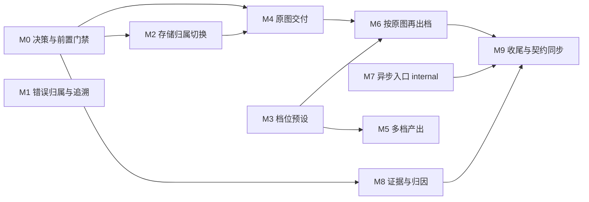

# CRT 接入对齐开发计划

状态：进行中。M1 仅剩内容安全拒绝的独立错误码待真实样本验证；M3 代码已交付，待三档视觉验收定稿；其余里程碑未开始。

本文把 [`integration-contract.md`](integration-contract.md) 中标为「计划」的内容拆成可独立合并、验证和发布的开发批次。接入契约定义调用方可依赖的行为；本文维护实施顺序、依赖、测试门槛和发布依赖。Process 的实现说明与后处理算法见 [`README.md`](README.md)。

每个里程碑必须让主分支保持可构建、可测试、可部署。后续批次不依赖未合并的分支。

## 已确认的实施基线

- `POST /execute` 的同步契约不变。新增能力表现为新的 `process` 值或输出上的 additive optional 字段，不新增路径、不改变既有字段语义。
- 产物写入调用方的对象存储 bucket。服务端不持有产物，保留期与删除责任归调用方。
- 按原图再出档（B′）是终态；提交时多档产出（A）只作过渡，上线后不承诺长期维护。
- 档位以命名预设发布，每档绑定 `blockSize` 与扫描线周期，不开放连续参数。
- 再出档 Process 不调用模型、不使用 Agent，是纯确定性后处理。
- Agent 不感知档位。`blockSize` 与扫描线周期不进入 Prompt 或 recipe 契约。

## 交付顺序

`M1`、`M3`、`M7` 没有前置依赖，可与 `M0` 并行启动。到 B′ 的关键路径是 `M0 → M2 → M4 → M6`，其中 `M3` 必须先于 `M6` 完成。

| 里程碑 | 状态 | 可交付结果 | 前置依赖 |
| --- | --- | --- | --- |
| M0 决策与前置门禁 | 未开始 | 三项评审结论、接入方凭证、生产配置实测值 | 无（含外部输入） |
| M1 错误归属与追溯 | 进行中 | 失败可归因、可按调用方 trace id 串联 | 无 |
| M2 存储归属切换 | 未开始 | 最终产物落在调用方 bucket | M0 凭证 |
| M3 档位预设 | 代码已交付，待视觉验收 | `fine` / `normal` / `coarse` 三档 | 无 |
| M4 原图交付 | 未开始 | 响应携带模型原图引用 | M0 产品决定、M2 |
| M5 多档产出 | 未开始 | 一次调用返回多档产物 | M3 |
| M6 按原图再出档 | 未开始 | 纯后处理 Process 与回源约束 | M0 产品与安全、M3、M4 |
| M7 异步入口 internal | 未开始 | `/process-runs` 对内部调用方可用 | 无（基建） |
| M8 证据与归因 | 未开始 | 生产 `metadata` 证据与失败记录 | M0 数据评审 |
| M9 收尾与契约同步 | 未开始 | 文档、规则与遗留缺陷收敛 | M6、M7、M8 |

## M0：决策与前置门禁

本阶段不修改生产执行路径。它关闭会改变公开契约、数据边界或出站行为的未决项。任一项未结论时，依赖它的里程碑不得开工。

### 任务

- **产品决定**：是否允许把 finalizer 之前的模型原图交付给调用方。这不违反已写下的不泄露清单（Prompt、recipe、模型、Skill），但改变服务的对外定位，须由发布负责人拍板。否决则 M4 与 M6 作废，需重新评估服务端保留原图的方案。
- **安全评审**：再出档需要服务端下载调用方回传的 URL，这是本服务首次产生此类出站请求。评审范围是出站主机白名单、重定向处理、响应大小与超时上限，以及 URL 归属校验的实现位置。
- **数据评审**：生产启用 `metadata` 证据模式的授权、隔离、期限与删除责任。范围不含图片字节与 Prompt。
- **接入方交付**：对象存储的 bucket、region、prefix、访问方式（公开读或签名）与写入凭证。最小权限是指定 prefix 下的 `PutObject` 与 `GetObject`。
- **核实生产配置**：确认部署的 `PROCESS_TIMEOUT_MS`、`CRT_API_TIMEOUT_MS`、`OSS_URL_ACCESS` 与签名有效期与 [`mvp-release-runbook.md`](../../mvp-release-runbook.md#初始容量与超时) 的发布值一致。发布值已要求 `PROCESS_TIMEOUT_MS=240000`，顺序正确；待修正的是代码默认值 30000 短于 `CRT_API_TIMEOUT_MS` 默认 180000 这一防呆问题，不是生产风险。

### 完成门槛

- 三项评审各有明确结论与责任人，否决项记录替代方案。
- 凭证通过 Secret 管理器注入，不进入仓库、镜像或 CI 日志。
- 生产配置实测值回填 [`integration-contract.md`](integration-contract.md) 的对应说明。

## M1：错误归属与追溯

目标是让调用方能区分失败是否已产生模型费用，并能用自己的 trace id 串联双方日志。本阶段不改变成功路径。

### 任务

- ~~在 CRT Business API 中按失败位置发出稳定错误码：模型调用返回之前、模型调用返回之后。切分点是图片编辑调用的返回处。~~ 已交付。
- ~~让 CRT Rendering Capability 的 HTTP Adapter 保留下游错误码，不再把所有非 2xx 折叠成同一个异常。~~ 已交付：只读取稳定错误码，其余响应内容丢弃。
- ~~在 Registration 中把子码映射为公开错误码，并保持错误净化。~~ 已交付：`DEPENDENCY_FAILURE` 与 `DEPENDENCY_FAILURE_AFTER_COMMIT`，后者在类型层面不可配置为自动重试。
- **待办**：供应商内容安全拒绝的独立终态码。须先用真实拒绝样本验证可识别性；验不通不发。
- ~~`/execute` 读取调用方的 `X-Request-Id`，写入运行日志，长度与字符集受限；不回显、不进入产物或证据。~~ 已交付：记录在本次请求的每一条日志上，包括没有 `runId` 的传输层拒绝。

### 测试

- 三类失败分别产生各自的公开错误码与 HTTP 状态码。
- 内容安全拒绝不与依赖故障共用错误码。
- 错误响应与日志都不含供应商正文、Prompt、URL 或凭证。
- 缺失、超长或含非法字符的 `X-Request-Id` 不影响执行结果。
- 现有 `/execute` 测试除新增错误码外预期不变。

### 完成门槛

- `npm run check`、`npm run typecheck`、`npm test`、`npm run build` 通过。
- 调用方按错误码即可判定「未计费可人工重试」与「已计费需知情」，无需查日志。

## M2：存储归属切换

目标是让最终产物直接落在调用方的 bucket。这一步是纯配置改动，可独立验收，不等待任何代码里程碑。

### 任务

- 把对象存储配置指向调用方的 bucket、region、凭证与 prefix。
- 确认访问方式与签名有效期，并核对返回的 `expiresAt` 语义符合接入契约。

### 测试

- 现有对象存储配置解析测试覆盖新的取值形状。
- 业务验收确认产物写入目标 bucket，且返回的 URL 可下载、字节与生成物一致。

### 完成门槛

- 一次真实业务验收通过（联网、产生模型与存储费用，须先确认凭证与费用范围）。
- 服务端不再保留最终产物副本，证据模式仍为 `off`。

## M3：档位预设

目标是把 `blockSize` 与扫描线周期打包成命名档位，并保证缺省行为与当前完全一致。

### 任务

- 将 finalizer 中固定的 `blockSize` 与扫描线周期提取为一组档位参数，棋盘格周期继续跟随 `blockSize`。
- 发布 `fine` / `normal` / `coarse` 三档，`normal` 等于当前取值。
- 产品输入新增可选档位字段，缺省与缺省值都解析为 `normal`。
- 内部 Business API 的入参与幂等摘要覆盖档位，保证同键换档位判为冲突而非返回旧结果。

### 测试

- 不传档位时，输出与当前实现字节级一致。
- 三档各自产出目标尺寸、调色板合规的 PNG。
- 同一幂等键换档位重投返回冲突，不返回旧结果，也不重复调用模型。
- 档位不出现在 Agent 请求、Prompt 或 recipe 校验中。

### 完成门槛

- `normal` 档对既有样本字节级复现，作为自动回归断言。
- 三档各完成一轮人工视觉验收（联网、产生费用），样张归档。

## M4：原图交付

目标是把 finalizer 之前的模型输出写入调用方 bucket，并在响应中给出引用。

### 任务

- 在现有上传路径上增加原图对象，对象键由 `runId` 派生且与最终产物区分。
- 产品输出新增 additive optional 的原图引用，现有调用方不受影响。
- 证据 manifest 记录原图对象键与摘要，不记录完整 URL。

### 测试

- 成功响应同时包含最终产物与原图引用，两者对象键不冲突。
- 原图引用满足与最终产物相同的 URL 约束（HTTP(S)、无用户名密码）。
- 上传失败按依赖故障处理，不产生部分成功的响应。
- 未启用原图交付时，输出与 M3 完全一致。

### 完成门槛

- 调用方可下载原图，且用 `normal` 档对其重跑能字节级复现同一次调用返回的最终产物。

## M5：多档产出（过渡）

目标是让一次调用返回多个档位的产物，只重复执行 finalizer，不重复调用模型。

### 任务

- 产品输入接受档位列表，产品输出以 additive optional 字段返回多份产物。
- 内部 Business API 对同一份模型输出执行多次 finalizer，并为每档写入独立对象。
- 幂等摘要覆盖完整档位列表。

### 测试

- 一次请求只调用一次模型，产生与档位数相同的对象。
- 单档请求的输出与 M3 行为一致。
- 任一档 finalizer 失败时整体判为失败，不返回部分产物。

### 完成门槛

- 单次调用的模型费用与档位数无关。
- 文档明确该能力是过渡形态，B′ 上线后不承诺长期维护。

## M6：按原图再出档（终态）

目标是新增一个纯后处理 Business Process：接收调用方回传的原图引用与目标档位，不调用模型、不使用 Agent。

### 任务

- 新增 Process Registration，输入为原图 URL 与档位，输出与 CRT 产物结构一致。
- 实现回源读取：出站主机白名单，并校验 URL 确实指向已配置的 bucket 与 prefix；形状合法不等于归属合法。
- 施加响应大小、超时与重定向限制，读取失败归入依赖故障。
- 该 Process 走同步 `/execute`，不依赖异步入口。

### 测试

- 对同一原图重复出档得到字节级一致的结果。
- 指向白名单之外主机、其他 bucket 或其他 prefix 的 URL 被拒绝。
- 重定向到非白名单主机被拒绝。
- 超尺寸或超时的回源按依赖故障返回，不产生部分产物。
- 该 Process 不构造 Agent，也不调用图片供应商。

### 完成门槛

- 安全评审结论中的全部控制项均有对应测试。
- 单次再出档不产生任何模型费用。

## M7：异步入口 internal

目标是让 `POST /process-runs` 对内部调用方可用。代码已完成，本阶段是基础设施与发布门禁。

### 任务

- 部署 PostgreSQL 与 Redis，完成 migration 与备份恢复验证。
- 把生产 Compose 从当前两个容器扩展为 API、Process Dispatcher、Process Worker、Webhook Worker 与 Retention Cleaner 五个角色。
- 网关剥离外部同名身份头并注入调用方身份与网关令牌，确认容器端口不可绕过网关访问。
- 配置三项保留期、两项 backlog 上限与发布阶段，按接入方要求把元数据保留期设为 90 天。
- 按 [`async-process-runs-runbook.md`](../../async-process-runs-runbook.md) 通过 `internal` 阶段门禁。

### 测试

- 真实 PostgreSQL 与 Redis 的集成测试通过（会重建测试 schema 并清空指定 Redis database，执行前须逐字核对连接串）。
- 提交、查询与幂等重放的行为符合接入契约。
- 同步 `/execute` 的延迟与错误映射没有回归。

### 完成门槛

- 内部调用方可完成一次提交、轮询与终态获取。
- 若本里程碑晚于承诺时点，必须先交付 `/execute` 的过渡期鉴权：挂上与异步入口相同的网关身份头。

## M8：证据与归因

目标是让服务端能按 `runId` 回答「这次用了哪个模型、哪个 Skill 版本、失败在哪一步」。

### 任务

- 生产启用 `metadata` 证据模式。
- 失败时同样写入 manifest，当前实现只在成功路径写入。
- manifest 增加 Skill 版本、状态、公开错误码与耗时。
- 为 manifest 建立落库或日志投递路径，并设置与元数据一致的保留期与清理，替代当前只写本地卷、无清理的形态。

### 测试

- 成功与失败都产生 manifest，且都不含 Prompt、recipe、凭证或完整 URL。
- manifest 可按 `runId` 检索，超期后被清理。
- 证据写入失败不改变产品执行结果。

### 完成门槛

- 数据评审结论中的授权、隔离、期限与删除责任均已落实。
- 本地卷不再是唯一存放位置。

## M9：收尾与契约同步

### 任务

- 修复异步入口幂等重放返回的状态恒为排队中的问题，使其反映真实状态。
- 修订 `AGENTS.md` 的「CRT 图片输入」：服务端在再出档路径下会下载调用方 URL，须写明适用范围与出站约束。
- 把 [`integration-contract.md`](integration-contract.md) 中已交付的「计划」项迁入「当前行为」，并更新决策记录的落地状态。
- 同步 [`README.md`](README.md)、[`../../development.md`](../../development.md) 与 [`../../experiments.md`](../../experiments.md) 中受影响的段落。

### 完成门槛

- 接入契约中不再有已实现却仍标为计划的条目。
- `AGENTS.md` 与实际出站行为一致。
