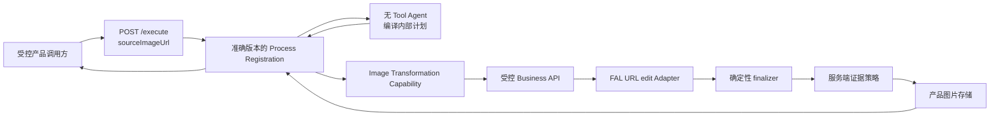

# 参考图转换 Business Process 开发模板

本文把 `crt-interface-image/v1` 作为可运行样板，说明如何开发“用户上传参考图，服务端调用图片模型编辑，再执行确定性后处理并返回图片引用”的 Business Process。新流程应复用这里的边界和开发顺序，但必须拥有自己的 Process ID、准确版本、产品 Schema、Runtime Skill、验收样本和发布门禁。

这是一份开发模板，不是第二套 Workflow 定义格式。生产仍只执行代码定义、显式注册的 Business Process；不要把步骤、Prompt、Skill、模型或运行配置放进产品请求。

## 适用范围

本模板适合以下流程：

- 产品先上传一张图片，再用不透明资产标识发起转换；
- Agent 根据固定 Runtime Skill 编译内部 Prompt 或 recipe；
- Business API 用参考图调用 GPT Image 2 或同类受控 Adapter；
- 服务端执行调色板、尺寸、水印或其他确定性 finalizer；
- 产品只收到稳定的图片引用和业务元数据；
- 开发环境需要保存可复查证据，生产环境默认不保留额外副本。

纯文本处理、无需参考图的图片生成、用户可编排步骤或通用图像编辑器不应直接套用本模板。

## 开发输入模板

开始编码前，先填写下面的最小 brief。缺少不会改变公开契约的信息时，可以从仓库事实推断；涉及权限、费用、敏感数据或不可逆副作用时，必须明确答案。

```markdown
# <process-id>/<version>

- 业务目标：
- 受控调用方：
- 上传资产类型和大小上限：
- 产品输入字段：
- 产品输出字段：
- 固定 Runtime Skill 来源和版本：
- 图片模型与供应商边界：
- 确定性后处理：
- 付费或持久化副作用：
- 幂等键：
- 超时与取消：
- 数据敏感性和保留期限：
- 稳定公开错误：
- 本地验收样本：
- 生产发布门禁：
```

不兼容的产品输入、输出、成功语义或公开错误需要新版本。模型、供应商、Prompt 措辞、finalizer Implementation 和开发证据目录通常属于服务端实现变化，不应迫使产品升级版本。

## 目标结构

每个 Business Process 使用自己的代码 Module 和文档目录。下面是参考图转换流程的推荐形状；只创建新流程实际需要的文件。

```text
docs/processes/<process-id>/
├── README.md                    # 稳定入口：契约、顺序、错误、边界
├── development-template.md     # 可选：该类流程的开发样板
└── evidence-retention.md       # 可选：敏感证据策略

src/processes/<module>/
├── registration.ts             # Schema、Definition、依赖和稳定策略
├── agent.ts                    # 窄 Agent Interface
├── pi.ts                       # Agent Adapter
├── skills.ts                   # 固定 Runtime Skill 集合
├── capability.ts               # 图片转换 Business Capability
├── http.ts                     # 受控 Business API Adapter
└── style.ts                    # 业务枚举和稳定视觉约束

.pi/skills/<runtime-skill>/
├── SKILL.md
└── SOURCE.md

examples/
├── <process>-business-acceptance.ts
└── support/
    ├── local-<process>-business-api.ts
    ├── <process>-finalizer.ts
    └── <process>-evidence.ts

test/
├── <process>-process.test.ts
├── <process>-http.test.ts
├── <process>-local-business-api.test.ts
└── <process>-evidence.test.ts
```

`crt-interface-image/v1` 的准确入口列在 [流程主页](README.md#代码入口)。先阅读现有 Interface，再决定是否需要新的 Seam；不要因为供应商不同就复制整套 Process Definition。

## 固定公开 Interface

产品请求只表达业务选择和可公开读取的参考图 URL。模型和保存策略由服务端拥有。

```json
{
  "process": "<process-id>",
  "version": "<exact-version>",
  "input": {
    "sourceImageUrl": "https://images.example.com/source.png",
    "<businessOption>": "<allowed-value>",
    "aspectRatio": "4:3"
  }
}
```

产品输入可以包含调色板、画幅或模板类型等稳定业务字段。它不能包含：

- 图片文件路径、非 HTTPS/内网 URL 或 Base64 图片；
- Prompt、recipe、步骤或脚本；
- Runtime Skill 名称、来源地址或版本；
- provider、model、quality、API key 或 Base URL；
- evidence mode、保存目录、bucket 或对象键；
- 重试次数、超时或内部 Tool 配置。

成功结果返回受控 HTTP(S) 图片引用、媒体类型、尺寸和必要的业务字段。不要返回 Prompt、供应商响应、内部对象键、资产路径或凭证。

## 服务端执行模板



按以下顺序实现：

1. **固定契约。** 为输入和输出建立 strict Schema，定义成功语义、稳定错误、超时和副作用。给新行为分配准确版本，不增加 `latest`、默认版本或版本回退。
2. **审查 Runtime Skill。** 检查完整来源、许可证、脚本、Tool 和网络权限，固定不可变版本，并把受限 Runtime 快照放入 `.pi/skills/`。生产请求不能下载远程 Skill。
3. **实现 Registration。** 在 factory 内绑定 Schema、Process Definition、Agent、Capability 和稳定策略。把 Registration 加入显式 production catalog。
4. **限制 Agent。** 参考图转换 Agent 通常只编译 Prompt 和 recipe，不需要 Tool，也不应看到图片字节、资产标识、凭证或文件系统。Registration 必须验证 Agent 结果后才能调用付费 Capability。
5. **定义 Capability。** Process Definition 只依赖窄业务方法。HTTP、multipart、Data URI、供应商 SDK、模型错误和认证留在 Adapter 内。
6. **实现 URL 边界。** 只接受公网 HTTPS URL，限制长度并拒绝账号密码、fragment、自定义端口、localhost 和 IP literal；完整 URL 不进入日志。
7. **实现 Business API。** 先用 Process `runId` 原子 claim 幂等键，再把 URL 原样交给 FAL、执行 finalizer、按证据策略留存、持久化产品图片并保存幂等结果。
8. **实现确定性 finalizer。** 把模型难以稳定保证的尺寸、调色板、签名或编码要求放入可测试代码。finalizer 不得偷偷改变公开画幅或生成额外付费调用。
9. **固定证据策略。** 在 Business API 的 Composition Root 选择 `off`、`metadata` 或 `full`。开发验收可以默认 `full`；生产必须默认 `off`。
10. **从公共 Seam 验证。** 先运行不联网测试，再运行显式付费 smoke 和公网 URL 业务验收，最后在目标环境启用正式 OSS。

## 配置归属模板

同一个配置只有一个所有者。不要让环境变量穿透到产品 Schema。

| 配置 | 所有者 | 示例 |
| --- | --- | --- |
| 业务枚举与公开画幅 | Process Registration | `palette`、`aspectRatio` 的允许值 |
| Agent Skill 集合 | Process Registration | 固定 `.pi/skills/<name>` |
| provider、model、quality | Business API Composition Root | `openai`、`gpt-image-2`、`low` |
| 图片供应商凭证和 Base URL | 部署 Secret | API key、中转站 URL |
| 模型和 Business API timeout | 服务端 Composition Root | 有界毫秒值 |
| 证据模式和证据位置 | Business API Composition Root | `off`、`metadata`、`full` |
| 产品图片 bucket、签名和期限 | 图片存储 Adapter | 私有对象存储策略 |
| 本地测试源文件 | 显式 acceptance 命令 | 绝对文件路径 |

参考实现使用：

```env
CRT_IMAGE_EVIDENCE_MODE=off|metadata|full
CRT_IMAGE_EVIDENCE_DIRECTORY=artifacts/crt-interface-image/acceptance/runs
```

新 Process 应使用自己的清晰前缀。测试配置也属于服务端；不要为了方便把这些字段加入 `/execute`。

## 证据留存模板

图片流程应区分“产品最终资产”和“开发或排障证据”。推荐复用以下语义：

| 模式 | 行为 | 推荐环境 |
| --- | --- | --- |
| `off` | 不创建额外证据副本 | production 默认 |
| `metadata` | 只保存脱敏 manifest 和哈希 | 经批准的 staging |
| `full` | 保存输入、模型原始结果、finalizer 结果和 manifest | 本地开发、显式付费验收 |

manifest 最后写入，并至少关联 Process ID、版本、`runId`、provider、model、operation、request ID、usage、媒体类型、尺寸、字节数和 SHA-256。它必须省略 API key、Base URL、Prompt、revised Prompt、供应商错误正文和签名 URL。

`off` 不代表删除产品最终图片。两类数据必须拥有独立权限、期限和删除策略。CRT 的完整参考语义见 [证据留存文档](evidence-retention.md)。

## 测试模板

### 1. 确定性测试

这些测试不能联网或产生费用：

- strict 产品 Schema 拒绝多余实现字段；
- Agent 看不到资产标识，Capability 只在 Agent 结果通过校验后调用；
- 同一个 `runId` 只产生一次图片转换副作用；
- HTTP Adapter 使用准确协议并净化远端错误；
- finalizer 固定尺寸、编码和业务视觉约束；
- `off`、`metadata`、`full` 写入准确文件并脱敏 manifest；
- 公共结果不包含 Prompt、recipe、凭证或内部路径；
- production catalog 只精确注册声明的版本。

### 2. 真实图片 edit smoke

smoke 只验证图片 Adapter 能用参考图获得真实模型结果。命令必须显式说明会联网、产生费用和写入的位置；报告不得保存 Prompt 或凭证。smoke 不替代 Process 验收。

### 3. 公网 URL 业务验收

完整本地验收必须覆盖：

```text
sourceImageUrl → POST /execute → production catalog
→ Agent → production HTTP Adapter → local Business API
→ FAL GPT Image 2 reference edit → finalizer → evidence policy
→ 本地或 OSS image URL → 下载与哈希核对
```

CRT 样板命令：

```bash
CRT_SOURCE_IMAGE_URL=https://images.example.com/source.png \
IMAGE_PROVIDER=fal \
FAL_KEY=replace-with-local-secret \
CRT_IMAGE_EVIDENCE_MODE=full \
npm run accept:crt-business
```

验收报告必须同时指出它证明了什么、没有证明什么。验收不能证明所有来源站点都允许 FAL 读取，也不能替代生产身份、容量和线上部署检查。

### 4. 生产验收

目标环境用受鉴权上传、生产 Business API 和受控对象存储替换本地 Adapter，并复查相同契约、幂等、下载、权限和删除判据。任何真实模型调用都应记录费用和 request ID，但不得自动重试“可能已经计费”的未知结果。

## 完成标准

提交前逐项确认：

- [ ] Process ID 和版本准确，production catalog 显式注册；
- [ ] 产品 Schema 只含业务字段，拒绝 Prompt、模型和运行配置；
- [ ] Runtime Skill 已审查、固定并记录许可证状态；
- [ ] Agent 权限最小，输出在付费调用前完成校验；
- [ ] Capability Interface 隐藏供应商协议和凭证；
- [ ] 上传资产有 caller ownership、文件安全和生命周期设计；
- [ ] Business API 用 `runId` 建立幂等，图片模型最多调用一次；
- [ ] finalizer 可重复、可测试，且不依赖 Agent 工具权限；
- [ ] 证据策略由服务端配置，production 默认 `off`；
- [ ] 确定性测试、真实 edit smoke 和本地业务验收各自有明确入口；
- [ ] `README.md`、`CONTEXT.md`、相关设计和发布文档反映当前事实；
- [ ] `npm run check`、`npm run typecheck`、`npm test` 和 `npm run build` 通过；
- [ ] 未完成的上传、存储、权限、许可证或部署工作在文档中明确列出。

完成这些项目后，开发者得到的是一个版本化、服务端拥有、可验收的 Business Process，而不是一段只能在本机演示的图片生成脚本。
