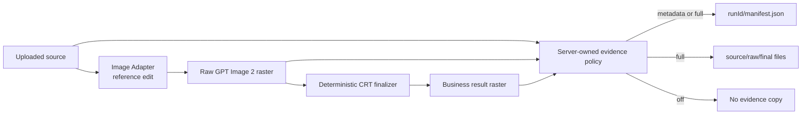

# CRT 图片证据保留

本文面向开发和发布 `crt-interface-image/v1` 的工程师，定义参考图、GPT Image 2 原始结果、CRT 最终结果和调用元数据如何按环境保留。证据策略由服务端配置，并绑定准确的 Business Process 版本；产品调用方不能通过 `/execute` 开启、关闭或选择保存目录。

## 当前结论

仓库内的无 OSS 验收 Implementation 支持 `off`、`metadata` 和 `full` 三档证据策略。`accept:crt-business` 默认使用 `full`，便于开发者复查真实参考图编辑；生产 `POST /crt-images` 必须默认使用 `off`，只有完成数据授权、隔离、期限和删除评审后才能启用其他模式。

证据副本与产品图片是两类数据。`off` 只禁止额外保存调试证据；Business Process 成功返回的最终图片仍须按产品资产策略持久化和交付。

## 服务端配置

| 配置 | 值 | 作用 |
| --- | --- | --- |
| `CRT_IMAGE_EVIDENCE_MODE` | `off`、`metadata`、`full` | 选择 `crt-interface-image/v1` 的证据保留级别 |
| `CRT_IMAGE_EVIDENCE_DIRECTORY` | 本地绝对或相对目录 | `metadata` 和 `full` 的每次 Run 根目录；`off` 忽略该值 |

模式缺省值由 Composition Root 决定，而不是由产品请求决定：

| 环境或入口 | 缺省模式 | 原因 |
| --- | --- | --- |
| `npm run accept:crt-business` | `full` | 该命令的目的就是形成可人工复查的付费验收证据 |
| 本地普通开发服务 | `off`，按需显式覆盖 | 避免开发者无意复制敏感图片 |
| staging | `off` 或经过批准的 `metadata` | 优先保留关联信息，不保留像素 |
| production | `off` | 原图和模型结果属于敏感业务内容，不应成为普通运行日志或调试文件 |

生产 Business API 尚不在本仓库内。实现生产 `POST /crt-images` 时，应复用同一模式语义，并在服务启动时解析配置。不要把模式、目录、期限或上传地址加入 `/execute` 或 `POST /crt-images` 的请求 body。

## 保留内容

| 模式 | 保存内容 | 适用场景 |
| --- | --- | --- |
| `off` | 不创建证据目录 | production 默认、敏感数据测试 |
| `metadata` | 只写 `manifest.json` | staging 关联排障、费用和供应商调用核对 |
| `full` | 原图、模型原始图、CRT 成品和 `manifest.json` | 本地开发、视觉调试、显式付费验收 |

`full` 模式按 Process `runId` 写入独立目录：

```text
artifacts/crt-interface-image/acceptance/runs/<runId>/
├── source.png|jpg|webp
├── raw-gpt-image-2.png|jpg|webp
├── final-crt.png
└── manifest.json
```

`source.*` 是上传 Interface 接受的准确字节；`raw-gpt-image-2.*` 是图片 Adapter 返回、尚未经过 finalizer 的准确字节；`final-crt.png` 是确定性调色板、像素格、扫描线和签名处理后的结果。`manifest.json` 最后写入，因此它也表示同目录中的必需证据已经完整落盘。

## 执行与关联



一次成功的 manifest 至少记录：

- `crt-interface-image/v1` 和 Process `runId`；
- 图片 provider、`gpt-image-2`、`reference-edit` 操作、quality 和供应商 request ID；
- 上游返回的 token usage；
- 调色板和画幅；
- 原图、模型原始图和最终图的媒体类型、尺寸、字节数和 SHA-256；
- finalizer 使用的颜色和 block size；
- 当前证据模式和 schema version。

manifest 永远省略 API key、Base URL、Prompt、revised Prompt 和供应商原始错误正文。`metadata` 模式仍计算三个阶段的哈希，但不写图片字节。

## 本地开发

以下命令会读取本地参考图、调用真实 Agent 和图片模型、产生费用，并把完整证据写入本地 `artifacts/`。运行前确认图片可以用于开发验收：

```bash
CRT_SOURCE_IMAGE_FILE=/absolute/path/to/non-sensitive-test-image.png \
CRT_IMAGE_EVIDENCE_MODE=full \
npm run accept:crt-business
```

命令完成后先打开 `acceptance/latest.md`。报告会列出本次 Run 的 manifest、原图、模型原始图和最终图。再核对以下事实：

1. `source.*` 的 SHA-256 等于 manifest 的 `source.sha256`。
2. `raw-gpt-image-2.*` 的 SHA-256 等于 `raw.sha256`，且 request ID 与图片网关或供应商记录一致。
3. `final-crt.png` 的 SHA-256 等于 `final.sha256`，并与 Business Process 返回 URL 下载的内容一致。
4. `raw` 与 `final` 的哈希不同，证明 finalizer 确实执行。
5. manifest 不包含 Prompt、凭证或 Base URL。

只需要关联元数据时运行：

```bash
CRT_SOURCE_IMAGE_FILE=/absolute/path/to/non-sensitive-test-image.png \
CRT_IMAGE_EVIDENCE_MODE=metadata \
npm run accept:crt-business
```

禁用每次 Run 的证据副本时设置 `CRT_IMAGE_EVIDENCE_MODE=off`。验收命令仍写 `latest.json`、`latest.md` 和最终预览，因为这些文件属于显式验收报告，不代表生产运行时行为。

## 生产实现要求

生产 Business API 应遵守以下约束：

- 在启动时固定证据模式；拒绝未知值和缺少目录的启用配置。
- 以 `runId` 建立目录或对象前缀，不能使用产品提交的文件路径。
- `off` 不创建证据副本；结构化日志只记录 `runId`、Process identity、阶段、稳定状态和经过批准的 request ID。
- `metadata` 与 `full` 必须使用私有、最小权限、按租户隔离的存储，并设置明确到期时间。
- `full` 必须把原图、模型原始图和最终图视为敏感业务内容；访问、下载和删除都要审计。
- 证据写入启用后属于验收要求。当前本地参考 Implementation 在 manifest 无法完整落盘时让 `POST /crt-images` 失败；模型调用可能已经计费，因此不得自动再次调用图片模型，应依赖同一 `runId` 的幂等记录处理。
- 证据到期不应删除仍由产品资产策略保留的最终图片；两类生命周期独立管理。

仓库不会自动清理 `artifacts/` 中的开发证据。维护者应按团队批准的期限删除本地文件，且不得提交原图、模型原始图、最终图或 manifest 中的业务关联信息。

## 代码与测试入口

| 目标 | 文件 |
| --- | --- |
| 配置解析、manifest 和文件写入 | [`../../../examples/support/crt-evidence.ts`](../../../examples/support/crt-evidence.ts) |
| 本地 `POST /crt-images` 集成 | [`../../../examples/support/local-crt-business-api.ts`](../../../examples/support/local-crt-business-api.ts) |
| 验收报告与每次 Run 关联 | [`../../../examples/crt-business-acceptance.ts`](../../../examples/crt-business-acceptance.ts) |
| 策略和文件级测试 | [`../../../test/crt-evidence.test.ts`](../../../test/crt-evidence.test.ts) |
| Business API 跨 Interface 测试 | [`../../../test/crt-local-business-api.test.ts`](../../../test/crt-local-business-api.test.ts) |

确定性验证不访问模型或网络：

```bash
npm test -- test/crt-evidence.test.ts test/crt-local-business-api.test.ts
```
