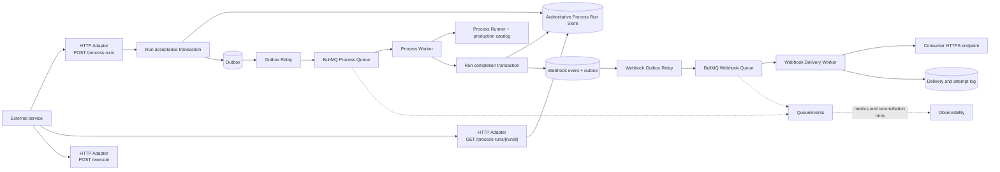

# 异步 Process Run、BullMQ 与可靠 Webhook 调研

检索日期：2026-08-09

本文面向准备扩展 Business Processing Service 的产品与开发者。它只使用 BullMQ、Redis、
Standard Webhooks、Stripe、IETF、AWS 和 Microsoft 的官方资料，研究异步提交、任务持久化、
状态查询、重试和 Webhook 投递。本文记录调研与提案，不定义当前产品行为；正式采用后，仍需
更新 [`CONTEXT.md`](../../CONTEXT.md)、公开 README、Process Runtime 设计、测试和 Runbook。

文中使用三个标签区分结论性质：

- **仓库事实**：当前代码或规范已经具备的行为。
- **外部事实**：官方资料明确说明的能力或限制。
- **建议**：根据仓库约束和外部事实作出的设计推断，尚未实现。

## 结论

外部服务应继续调用 HTTP API，不应直接连接 Redis 或向 BullMQ 写 Job。推荐保留同步
`POST /execute`，新增异步 `POST /process-runs` 和查询 `GET /process-runs/{runId}`。异步提交成功后返回
`202 Accepted`、`Location` 和 `Retry-After`；Webhook 只是完成通知，查询接口仍是最终可恢复的
公共事实来源。RFC 9110 规定 `202` 表示请求已接受但尚未完成，并建议响应指向状态监视资源；
Microsoft 的异步 Request-Reply 官方模式也采用 `202 + Location + Retry-After + GET status`。
[RFC 9110：202 Accepted](https://www.rfc-editor.org/rfc/rfc9110.html#name-202-accepted)、
[Microsoft：Asynchronous Request-Reply](https://learn.microsoft.com/en-us/azure/architecture/patterns/asynchronous-request-reply)

BullMQ 适合本项目的内部调度、Worker 并发、失败重试和崩溃恢复，但不应成为公开 Run 查询的
唯一存储。BullMQ 会保留或自动清理完成 Job，QueueEvents 的 Redis Stream 也会自动裁剪；
业务查询、幂等键、内容保留、Webhook 投递日志和人工重放需要独立的持久化模型。
[BullMQ：Auto-removal of jobs](https://docs.bullmq.io/guide/workers/auto-removal-of-jobs)、
[BullMQ：Events](https://docs.bullmq.io/guide/events)

推荐采用“持久化数据库是事实来源，BullMQ 是执行机制”的结构：

1. API 在一个数据库事务中写入 `Process Run` 和 enqueue outbox，再返回 `202`。
2. Outbox Relay 把 `runId` 加入 BullMQ；Job payload 只携带 `runId`，Worker 从数据库读取输入。
3. Process Worker 用服务端 production catalog 执行准确的 Process 版本。
4. Worker 在一个数据库事务中写入终态，并写入 Webhook event/outbox。
5. 独立 Webhook Worker 按 Standard Webhooks 签名、投递、记录尝试并重试。

数据库事务与 outbox 解决“状态已写但消息未发”或“消息已发但状态未写”的双写窗口。AWS 的
Transactional Outbox 官方指南明确要求在同一事务中写业务状态和 outbox，并提醒消息 Relay
仍可能重复发布，因此消费者必须幂等。
[AWS：Transactional outbox pattern](https://docs.aws.amazon.com/prescriptive-guidance/latest/cloud-design-patterns/transactional-outbox.html)

首期不建议使用 BullMQ Flows。当前一个 Process Run 对应一个受治理执行；Webhook 失败也不应
使 Process 重新执行。Flows 适合具有父子依赖的 Job 树，子 Job 成功后父 Job 才进入等待状态，
并会引入额外的失败传播语义。只有某个 Business Process 明确需要可独立重试的持久化子任务和
汇合点时，才应在该 Process Definition 内评估 Flows，且不能把 Flow 暴露为第二套产品领域模型。
[BullMQ：Flows](https://docs.bullmq.io/guide/flows)

### 对推荐方案的反证检查

**结论：** 本次一手资料中，没有发现会推翻“PostgreSQL 作为权威 Run Store、transactional
outbox 跨越数据库与 queue 边界、BullMQ 只负责内部调度、Standard Webhooks 负责签名”的官方
事实。官方资料反而给出以下必须纳入实现的限制；忽略它们才会使方案失效：

- BullMQ 最坏情况下是 at-least-once，stalled recovery 可能重复执行；Redis 异步复制也有数据
  丢失窗口。因此 PostgreSQL 中的 Run/outbox 必须能对账和重建 queue，Business Capability 必须
  用稳定 `runId` 保证副作用幂等。
  [BullMQ：What is BullMQ](https://docs.bullmq.io/)、
  [BullMQ：Stalled](https://docs.bullmq.io/guide/jobs/stalled)、
  [Redis：Replication](https://redis.io/docs/latest/operate/oss_and_stack/management/replication/)
- Transactional outbox 不能带来 exactly-once；Relay 可能重复发布。`jobId=runId` 只能减少常见
  重复，不能替代 Worker 和下游能力的幂等。
  [AWS：Transactional outbox pattern](https://docs.aws.amazon.com/prescriptive-guidance/latest/cloud-design-patterns/transactional-outbox.html)
- QueueEvents 的 Redis Stream 会自动裁剪，完成 Job 也可能被清理，所以两者都不能取代 PostgreSQL
  的公共状态和审计记录。
  [BullMQ：Events](https://docs.bullmq.io/guide/events)、
  [BullMQ：Auto-removal of jobs](https://docs.bullmq.io/guide/workers/auto-removal-of-jobs)
- Standard Webhooks 签名提供来源认证和完整性，不加密 payload，也不消除重复或乱序。Webhook
  必须发送最少内容、使用 HTTPS、保持可查询 API，并要求消费者按 `webhook-id` 幂等。
  [Standard Webhooks：Verification](https://github.com/standard-webhooks/standard-webhooks/blob/main/spec/standard-webhooks.md#verifying-signatures)、
  [Stripe：Webhook event delivery behaviors](https://docs.stripe.com/webhooks#event-delivery-behaviors)

PostgreSQL 是本项目的推荐 Implementation，不是 BullMQ 或 Standard Webhooks 的硬性依赖；若以后
替换数据库，替代品仍必须支持 Run 与 outbox 的同事务写入、唯一幂等约束、并发状态转换和可靠查询。

## 当前仓库事实与缺口

### 当前公开 Interface

**仓库事实：** 当前 HTTP 入口只提供 `GET /healthz` 和同步 `POST /execute`。HTTP Adapter 在
调用 Process Executor 前校验 media type、请求体大小和单实例并发；容量满时返回 `503` 和
`Retry-After`。[HTTP Adapter](../../src/api/http.ts)

**仓库事实：** `ProcessExecutor.execute(request)` 在内部生成 `runId`，解析请求、精确查找
Process Registration、启动 Process、执行超时竞争并返回终态。它不能接受由提交端预先分配的
`runId`。[Process Runtime](../../src/processes/runtime.ts)

**仓库事实：** 当前 `ProcessRunRecords` 只记录完成结果。`record` 是 best-effort，写入失败会被
忽略；默认 Adapter 禁用，另一个 Adapter 只保存在单进程内存中。它没有 `queued`、`running`、
`retrying` 等状态，也没有权威状态转换或跨实例存储。
[Process Run Records](../../src/processes/records.ts)

**仓库事实：** `package.json` 没有 BullMQ、Redis client 或数据库依赖。生产组装只创建同步
Application 和 Process Executor，`src/bin/api.ts` 收到 `SIGINT`/`SIGTERM` 时只关闭 HTTP server。
[package.json](../../package.json)、[Startup Construction](../../src/api/bootstrap.ts)、
[API entry](../../src/bin/api.ts)

### 异步化不能直接复用的地方

**建议：** 实现前必须解决以下 Interface 缺口，不能只在 HTTP handler 中添加 `queue.add()`：

- 异步提交端需要在入队前生成并持久化 `runId`，Worker 又必须让现有 Process Execution Context
  使用同一个 `runId`；当前 Executor 总是在内部生成新 ID。
- 当前 Registration 的 `start` 同步解析输入并立即启动 Process。异步 API 若要在返回 `202`
  前完整校验输入，需要新增“不启动执行的接受/规范化”Seam；否则只能在 Worker 中发现
  `INVALID_INPUT`，让调用方先收到 `202` 再查询失败结果。
- 当前 Run Record 写入失败不能影响执行结果。可查询异步 Run 需要权威 `ProcessRunStore`，其创建
  和终态写入必须被调用方等待并参与错误处理；不能暗中改变现有 best-effort Interface 的含义。
- 当前应用不接收已认证调用方身份。幂等键、Run 查询和 Webhook endpoint 都必须按调用方隔离，
  因此网关或平台需要把经过验证的 service principal 传入应用。
- 当前终态失败是一个正常 resolve 的 `ProcessRunResult`。BullMQ Worker 只会把抛出异常的处理器
  视为失败；若直接 `return executor.execute(...)`，`DEPENDENCY_FAILURE` 等结果会被 BullMQ 标成
  `completed`，自动重试不会发生。

这些缺口属于 Process Runtime 设计，不属于 BullMQ 配置问题。

## 推荐架构

### 责任分配



**建议：** 让数据库拥有 Run、幂等键、Webhook event 和 delivery；让 BullMQ 拥有等待、延迟、
Worker lock、并发和调度。这个划分带来三个结果：

- `GET /process-runs/{runId}` 不依赖 BullMQ Job 是否已清理。
- Redis 暂时不可用时，已提交的 outbox 仍可稍后入队。
- QueueEvents listener 暂停或事件被裁剪时，终态和 Webhook 仍不会丢失。

### 建议 Module 与 Seam

<!-- markdownlint-disable MD013 -->

| Module | 建议 Interface | 隐藏的 Implementation |
| --- | --- | --- |
| Async Run Application | `submit(request, caller, idempotencyKey)`、`find(runId, caller)` | 请求指纹、Run ID、事务、公开响应 |
| Process Run Store | `createAcceptedRun`、`claimAttempt`、`complete`、`find` | SQL、状态转换、内容保留、并发控制 |
| Process Queue | `enqueue(runId)`、`close()` | BullMQ Queue、Job options、Redis 连接 |
| Process Worker | `start()`、`close()` | BullMQ Worker、重试分类、Process Runtime 调用 |
| Outbox Relay | `start()`、`close()` | 批量 claim、入队、确认、补偿扫描 |
| Webhook Catalog | endpoint 的创建、轮换、禁用和查找 | URL 验证、Secret 加密、事件订阅 |
| Webhook Delivery | `deliver(deliveryId)` | payload、签名、HTTP、状态码、重试和 attempt log |

<!-- markdownlint-enable MD013 -->

**建议：** Process API、Process Worker 和 Webhook Worker 使用独立进程入口和独立部署单元。它们
可以共享 Module，但需要独立扩容、连接策略、就绪检查和关闭周期。Startup Construction 仍应
是每个入口的 Composition Root。

## 对外 API 契约

### 同步与异步并存

**建议：** 保留 `POST /execute` 的现有同步语义，新增资源式异步 API。不要让外部服务直接使用
BullMQ SDK，也不要暴露 Redis 地址、queue name、Job options、attempts、backoff 或 Flow。

| 调用目的 | Interface | 成功语义 |
| --- | --- | --- |
| 立即等待结果 | `POST /execute` | 保持当前 `200` 或公开失败状态码 |
| 提交后台执行 | `POST /process-runs` | 持久化接受后返回 `202` |
| 查询状态和结果 | `GET /process-runs/{runId}` | 返回 `200` 和当前 Run resource |
| 接收完成通知 | 已登记的 Webhook endpoint | 至少一次通知；消费者按 `webhook-id` 幂等 |

Webhook 不能替代查询。Webhook 在重试期限后仍可能投递失败，调用方必须能用 `runId` 查询最终
结果。Stripe 的官方文档同样同时强调异步处理、重复事件、自动重试和不保证事件顺序。
[Stripe：Webhook event delivery behaviors](https://docs.stripe.com/webhooks#event-delivery-behaviors)

### 提交示例

请求继续只包含准确 Process、版本和业务输入；服务端拥有执行策略：

```http
POST /process-runs HTTP/1.1
Host: business-processing.example.com
Content-Type: application/json
Authorization: Bearer <token>
Idempotency-Key: 7bc80e9f-3ee1-4af5-9b49-1d77d077ef44

{
  "process": "content-processing",
  "version": "v1",
  "input": {
    "content": "需要处理的内容"
  }
}
```

只有在 Run 和 enqueue outbox 已在同一事务中提交后，才能返回：

```http
HTTP/1.1 202 Accepted
Content-Type: application/json
Location: https://business-processing.example.com/process-runs/01J...
Retry-After: 2

{
  "runId": "01J...",
  "process": "content-processing",
  "version": "v1",
  "status": "queued",
  "submittedAt": "2026-08-09T08:00:00.000Z",
  "updatedAt": "2026-08-09T08:00:00.000Z",
  "links": {
    "self": "https://business-processing.example.com/process-runs/01J..."
  }
}
```

`202` 只确认“已可靠接受”，不承诺执行成功。若数据库事务未提交，返回稳定的 `5xx` 或容量错误，
不能分配一个随后查不到的 `runId`。Microsoft 的官方模式建议尽量在接受长任务前校验请求，
并在无效时直接返回 `400`。
[Microsoft：Asynchronous Request-Reply solution](https://learn.microsoft.com/en-us/azure/architecture/patterns/asynchronous-request-reply#solution)

### 查询示例

非终态始终返回 `200`，用 body 表达状态，并用 `Retry-After` 控制轮询：

```http
HTTP/1.1 200 OK
Content-Type: application/json
Retry-After: 2

{
  "runId": "01J...",
  "process": "content-processing",
  "version": "v1",
  "status": "running",
  "submittedAt": "2026-08-09T08:00:00.000Z",
  "startedAt": "2026-08-09T08:00:01.000Z",
  "updatedAt": "2026-08-09T08:00:01.000Z"
}
```

成功终态沿用当前输出形状：

```json
{
  "runId": "01J...",
  "process": "content-processing",
  "version": "v1",
  "status": "succeeded",
  "submittedAt": "2026-08-09T08:00:00.000Z",
  "startedAt": "2026-08-09T08:00:01.000Z",
  "finishedAt": "2026-08-09T08:00:08.000Z",
  "updatedAt": "2026-08-09T08:00:08.000Z",
  "output": {
    "content": "处理后的内容"
  }
}
```

失败终态继续使用稳定公开错误，不返回 BullMQ `failedReason`、stack trace、模型错误或远端响应：

```json
{
  "runId": "01J...",
  "process": "content-processing",
  "version": "v1",
  "status": "failed",
  "submittedAt": "2026-08-09T08:00:00.000Z",
  "startedAt": "2026-08-09T08:00:01.000Z",
  "finishedAt": "2026-08-09T08:00:08.000Z",
  "updatedAt": "2026-08-09T08:00:08.000Z",
  "error": {
    "code": "DEPENDENCY_FAILURE",
    "message": "The process dependency is unavailable"
  }
}
```

### 建议公开状态

| 状态 | 含义 | 是否终态 |
| --- | --- | --- |
| `queued` | Run 已持久化，等待首次或再次执行 | 否 |
| `running` | 至少一个 Worker attempt 正在执行 | 否 |
| `succeeded` | 输出已验证并持久化 | 是 |
| `failed` | 永久失败或重试已耗尽 | 是 |

**建议：** 首期把等待重试也表达为 `queued`，避免公开 attempts 与 backoff。以后若产品需要解释
等待原因，可增加兼容的 reason 字段或 `retrying` 状态。首期不开放取消；保留将来增加
`cancel_requested` 和 `cancelled` 的空间。BullMQ 内部
`waiting`、`delayed`、`active`、`completed`、`failed`、`waiting-children` 等状态不应直接成为
公共枚举。官方 Job lifecycle 和 `getJobState` 证明这些是 queue Implementation 状态，而不是
业务状态。[BullMQ：Architecture](https://docs.bullmq.io/guide/architecture)、
[BullMQ Queue.getJobState API](https://api.docs.bullmq.io/classes/v4.Queue.html#getjobstate)

### 提交幂等

**建议：** `POST /process-runs` 要求 `Idempotency-Key`，并在数据库中建立
`UNIQUE(caller_id, idempotency_key)`：

- 相同调用方、相同 key、相同请求摘要返回已有 Run，不再次入队。
- 相同调用方、相同 key、不同请求摘要返回 `409 Conflict`。
- key 至少保留到公开 Run 过期；调用方身份必须来自可信认证边界。
- 内部 BullMQ `jobId` 使用 `runId`，作为 outbox 重放时的第二层防重。

BullMQ 自定义 Job ID 只在单个 queue 内唯一；已存在的 ID 不会再次添加，但 Job 一旦被清理，
同一 ID 又可添加。因此 Job ID 不能替代长期 API 幂等记录。
[BullMQ：Job IDs](https://docs.bullmq.io/guide/jobs/job-ids)、
[BullMQ：Auto-removal and idempotence](https://docs.bullmq.io/guide/queues/auto-removal-of-jobs#what-about-idempotence)

Microsoft 的异步 Request-Reply 模式也建议提交端使用 idempotency key，在重复 POST 时返回已有
status resource，而不是创建第二个任务。
[Microsoft：Asynchronous Request-Reply considerations](https://learn.microsoft.com/en-us/azure/architecture/patterns/asynchronous-request-reply#issues-and-considerations)

## 持久化模型

### Process Run Store

**建议：** 新建权威 `ProcessRunStore`，不要把 BullMQ Job 当成 Run Record。关系数据库是默认
选择，因为接受 Run、写 outbox、完成 Run 和写 Webhook event 都需要原子事务；具体数据库产品
仍需单独决定。

建议最小字段如下：

<!-- markdownlint-disable MD013 -->

| 字段 | 目的 |
| --- | --- |
| `run_id` | 公共稳定 ID，也是内部 BullMQ `jobId` |
| `caller_id` | 查询授权和幂等范围 |
| `process_id`、`process_version` | 精确 production catalog identity |
| `status` | 公共 Run 状态 |
| `input_payload` 或 `input_ref` | Worker 执行所需的短期输入 |
| `output_payload` 或 `output_ref` | 查询期内的已验证结果 |
| `error_code`、`public_message` | 净化后的公开失败 |
| `idempotency_key`、`request_digest` | 提交防重和冲突检查 |
| `attempt_count` | Process attempt 计数 |
| `submitted_at`、`started_at`、`finished_at`、`updated_at` | 生命周期与卡住检测 |
| `expires_at` | 公开查询与内容删除期限 |
| `schema_version` | 持久化结构演进 |

<!-- markdownlint-enable MD013 -->

**建议：** Queue payload 只写 `{ "schemaVersion": 1, "runId": "..." }`。BullMQ 官方提醒 Job
`data` 以明文存储；把完整业务输入放进 Redis 会扩大敏感数据副本和保留面。
[BullMQ：Protecting data](https://docs.bullmq.io/guide/going-to-production#protecting-data)

异步执行无法延续“默认从不保存业务内容”的现有边界：Worker 至少要在执行前取得输入，查询成功
结果也要求暂存输出。正式设计必须为 input/output 分别定义加密、最大尺寸、访问审计和删除期限。
可以在终态后立即清除 input，并让 output 只保留公开查询窗口；大结果应转存对象存储并在 Run 中
保存受控引用。

### Outbox 与状态转换

**建议：** 至少需要两种 outbox message：

- `process_run.queued`：与初始或等待重试的 `queued` Run 同事务写入。
- `webhook_event.ready`：与 `succeeded` 或最终 `failed` 同事务写入。

Outbox Relay 通过行锁或 lease 批量 claim 未发布记录，调用 Queue Adapter，再记录发布结果。Relay
可能在 `queue.add()` 成功后、标记 outbox 成功前崩溃；重启后会再次添加。因此使用 `runId` 作为
Job ID，并让 Worker 在执行前检查数据库终态。即使如此，Job 清理或 stalled 重跑仍可能造成重复
执行，所有外部副作用必须具备业务幂等性。

**建议：** Run Store 只允许受控转换：

```text
queued -> running -> succeeded
                  -> failed
                  -> queued -> running
```

Worker 使用 compare-and-set 或 attempt lease 更新状态，迟到的旧 attempt 不能覆盖新 attempt 的
终态。每次重试沿用同一个 `runId`，并把该 ID 传给支持幂等键的 Business Capability。

### 保留与清理

**建议：** 分开定义两套 retention：

- Process Run Store retention 是公共产品契约，决定调用方能查询多久。
- BullMQ retention 是运维策略，只保留足够的近期完成/失败 Job 供排障和 outbox 对账。

BullMQ 默认保留完成和失败 Job，也支持按 age、count 和每次 cleanup limit 自动清理；清理是惰性的，
只有后续 Job 完成或失败时才发生。必须配置上限，避免 Redis 无限增长，但不能把这个上限误当成
Run API 的保留承诺。
[BullMQ：Auto-removal of jobs](https://docs.bullmq.io/guide/workers/auto-removal-of-jobs)

具体天数和数量应由流量、审计、隐私和故障恢复窗口决定，不能从 BullMQ 默认值推导。正式 API
应公开查询期限；过期后按授权策略返回 `410 Gone` 或不泄露存在性的 `404 Not Found`。

## BullMQ 官方能力与本项目用法

### 版本和 Redis

**外部事实：** 调研时 npm 上 BullMQ 当前版本为 `5.81.2`；正式实现应固定准确版本并根据
changelog 分阶段升级。[npm：bullmq](https://www.npmjs.com/package/bullmq)

**外部事实：** BullMQ 的核心类包括 `Queue`、`Worker`、`QueueEvents` 和 `FlowProducer`。
`Queue` 添加和管理 Job；`Worker` 可在同进程、不同进程或不同机器消费；`QueueEvents` 汇总所有
Worker 的全局事件。[BullMQ：Introduction](https://docs.bullmq.io/guide/introduction)

**外部事实：** 对本项目计划使用的标准 Redis backend，BullMQ 官方兼容 Redis 6.2.0 或更新版本。
生产必须使用 `maxmemory-policy=noeviction`，否则 Redis 可能删除 BullMQ 关键 key。BullMQ 还建议
显式启用 AOF persistence；Redis 官方说明 RDB 与 AOF 在性能和可丢失窗口之间有不同取舍，异步
replication 本身仍存在数据丢失窗口。
[BullMQ：Redis compatibility](https://docs.bullmq.io/guide/redis-tm-compatibility)、
[BullMQ：Going to production](https://docs.bullmq.io/guide/going-to-production)、
[Redis：Persistence](https://redis.io/docs/latest/operate/oss_and_stack/management/persistence/)、
[Redis：Replication](https://redis.io/docs/latest/operate/oss_and_stack/management/replication/)

**建议：** 使用独立、非缓存用途的 Redis，启用受监控的持久化、备份和高可用，并把数据库 outbox
保留为 queue 重建来源。`noeviction` 意味着内存用尽时写入失败，因此还需监控内存、queue depth、
oldest queued age 和 enqueue error。

### 连接策略

**外部事实：** BullMQ 类至少占用一个连接；需要 blocking command 的 Worker 和 QueueEvents 会
建立重复连接。对 ioredis，Worker 的 `maxRetriesPerRequest` 必须为 `null`；HTTP producer 的
Queue 应快速失败，官方建议 producer 禁用 `enableOfflineQueue`，Worker 则持续重连。
[BullMQ：Connections](https://docs.bullmq.io/guide/connections)、
[BullMQ：Production reconnections](https://docs.bullmq.io/guide/going-to-production#automatic-reconnections)

**建议：** API Queue、Process Worker、Webhook Worker 和 QueueEvents 使用独立连接配置并设置
`error` listener。连接数必须计入托管 Redis 限额。API 采用 outbox 后，Redis 临时断线不会让已经
提交数据库事务的 Run 消失；Relay 可以继续重试入队。

### Job 状态与 QueueEvents

**外部事实：** 普通 Job 的主要生命周期是 `waiting`/`prioritized`/`delayed` → `active` →
`completed` 或 `failed`；Flow parent 还可能处于 `waiting-children`。
[BullMQ：Architecture](https://docs.bullmq.io/guide/architecture)

**外部事实：** QueueEvents 使用 Redis Streams，因此比普通 Pub/Sub 更能承受短暂断线；事件流
默认自动裁剪到约 10,000 条，也可配置或手工裁剪。
[BullMQ：Events](https://docs.bullmq.io/guide/events)

**建议：** QueueEvents 只用于指标、日志和 reconciliation hint。因为事件会裁剪，且 QueueEvents
与业务数据库终态更新不在同一事务，它不能触发唯一一份 Webhook event，也不能作为 Run API
状态来源。Worker 的完成事务和定期数据库对账负责可靠性。

### 重试与退避

**外部事实：** `attempts` 设置总尝试次数；失败 Job 支持 fixed、exponential、jitter 和自定义
backoff。没有 backoff 时会立即重试。不可恢复错误可抛出 `UnrecoverableError`，跳过剩余自动
重试。[BullMQ：Retrying failing jobs](https://docs.bullmq.io/guide/retrying-failing-jobs)、
[BullMQ：Stop retrying jobs](https://docs.bullmq.io/patterns/stop-retrying-jobs)

**外部事实：** BullMQ 不内置通用 Job timeout；官方模式要求 Worker 自己用 timer 和
`AbortController` 中止工作。[BullMQ：Timeout jobs](https://docs.bullmq.io/patterns/timeout-jobs)

**建议：** 保留现有 Process Runner 的总超时和 `AbortSignal`，由 Process Registration 绑定
服务端重试策略。调用方不能上传 attempts 或 backoff。建议分类如下：

| 公开结果 | 默认分类 | 原因 |
| --- | --- | --- |
| `INVALID_INPUT`、`PROCESS_NOT_FOUND` | 永久失败 | 同一输入重试不会改变结果，最好在入队前拒绝 |
| `INVALID_OUTPUT` | 永久失败并告警 | 属于服务端契约错误 |
| `DEPENDENCY_FAILURE`、`AGENT_FAILURE` | 按 Process 策略判定 | 可能瞬时，也可能是永久配置错误 |
| `INTERNAL_ERROR` | 有限重试 | 只在 Process 副作用可幂等时启用 |
| `PROCESS_TIMEOUT` | 按 Process 策略判定 | 重试可能成功，也可能重复昂贵副作用 |

Queue Worker Adapter 必须把“本次 attempt 可重试”转换为抛出 Error，让 BullMQ 调度下一次
attempt；最终失败或不可重试结果则写 Run 终态。Webhook 投递失败只重试 Webhook Job，绝不能
重新执行已成功的 Business Process。

### 幂等、去重和 at-least-once

**外部事实：** BullMQ 官方目标是尽量一次交付，但最坏情况为 at-least-once。Worker 失去 Job
lock 时，Job 会从 `active` 回到 `waiting` 或进入 `failed`；不存在持久的 `stalled` 状态，只有
`stalled` 事件。默认超过一次 stall 后永久失败。进程崩溃、Redis 连接丢失或 Node event loop
长期被 CPU 工作占用都可能导致重复处理。
[BullMQ：What is BullMQ](https://docs.bullmq.io/)、
[BullMQ：Stalled](https://docs.bullmq.io/guide/jobs/stalled)、
[BullMQ：Troubleshooting missing locks](https://docs.bullmq.io/guide/troubleshooting#missing-locks)

**外部事实：** BullMQ 提供三类 deduplication：Simple 在 Job 完成或失败前忽略同 ID Job；
Throttle 在 TTL 内忽略；Debounce 在延迟窗口内延长 TTL 并替换为最新数据。官方仍要求可重试
Job 本身设计为幂等、原子和简单。
[BullMQ：Deduplication](https://docs.bullmq.io/guide/jobs/deduplication)、
[BullMQ：Idempotent jobs](https://docs.bullmq.io/patterns/idempotent-jobs)

**建议：** 区分三层机制：

- API idempotency 防止调用方因丢失 `202` 响应而创建两个 Run。
- BullMQ `jobId=runId` 防止 outbox Relay 的常见重复入队。
- Business Capability idempotency 防止 stalled、超时和崩溃造成的重复副作用。

BullMQ deduplication 适合削峰、throttle 或 debounce，不等于长期业务幂等。涉及发布、扣费、发送、
对象写入或其他副作用的 Process，必须向下游传递稳定幂等键，或在本地记录效果与补偿状态。

### 并发、限流和隔离

**外部事实：** Worker 支持单实例 local concurrency，也支持多个进程和机器横向扩展。local
concurrency 适合 I/O-heavy Job；CPU-heavy Job 应使用 sandboxed processor 或独立进程。BullMQ
还支持跨全部 Worker 的 global concurrency 和 global rate limit。
[BullMQ：Worker concurrency](https://docs.bullmq.io/guide/workers/concurrency)、
[BullMQ：Global concurrency](https://docs.bullmq.io/guide/queues/global-concurrency)、
[BullMQ：Global rate limit](https://docs.bullmq.io/guide/queues/global-rate-limit)

**建议：** Process Worker 从保守并发开始，通过 Business Capability 配额、模型限额、CPU、内存、
queue latency 和错误率调优。现有 `MAX_CONCURRENT_EXECUTIONS` 只限制同步 HTTP path，不能自动
约束独立 Worker。需要统一容量时，在 queue 上设置 global concurrency；需要保护远端依赖时再
设置 rate limit。Process 执行和 Webhook 投递使用不同 queue，避免失败 endpoint 占满 Process
容量。

### Graceful shutdown

**外部事实：** `worker.close()` 会停止领取新 Job，并等待当前 Job 完成或失败；该调用本身没有
timeout。不优雅关闭会让 Job 进入 stalled recovery。BullMQ 2.0 以后不需要已弃用的
`QueueScheduler`。[BullMQ：Graceful shutdown](https://docs.bullmq.io/guide/workers/graceful-shutdown)、
[BullMQ：QueueScheduler](https://docs.bullmq.io/guide/queuescheduler)

**建议：** Worker 进程在 `SIGINT`/`SIGTERM` 时按顺序停止领取 Job、等待当前 Process、关闭
QueueEvents/Queue/Redis 和数据库。部署平台的 termination grace period 必须大于受支持的 Process
超时；否则接受 stalled 重跑并依靠幂等。`worker.close()` 之外仍要为整体关闭设置平台级上限，
否则单个不响应的依赖会阻止进程退出。

## 可靠 Webhook

### 事件、Delivery 和 Attempt 分离

**建议：** Webhook 持久化至少包含四类记录：

<!-- markdownlint-disable MD013 -->

| 记录 | 关键字段 | 生命周期 |
| --- | --- | --- |
| `webhook_endpoints` | owner、HTTPS URL、event filters、encrypted secret/key、status | 配置与轮换 |
| `webhook_events` | stable message ID、type、occurred_at、immutable serialized payload、run_id | 一个业务事件一条 |
| `webhook_deliveries` | event_id、endpoint_id、status、attempt_count、next_attempt_at | 每个 endpoint 一条 |
| `webhook_attempts` | delivery_id、attempt_no、时间、HTTP status、duration、净化错误 | 每次 HTTP 尝试一条 |

<!-- markdownlint-enable MD013 -->

`webhook_events` 与 Run 终态同事务创建。每个 endpoint 独立投递；一个 endpoint 失败不能阻塞其他
endpoint，也不能改变 Process Run 终态。人工 replay 复用原 event，并创建新的 delivery/attempt
记录，从而保留审计链。

Standard Webhooks 建议 producer 提供失败列表、原因和手工 replay，支持消费者从长时间故障中
恢复。[Standard Webhooks：Visibility and manual retries](https://github.com/standard-webhooks/standard-webhooks/blob/main/spec/standard-webhooks.md#visibility-into-failures-and-manual-retries)

### Payload 与签名

**建议：** 采用 Standard Webhooks 格式，默认发送 thin payload：

```json
{
  "type": "process_run.succeeded",
  "timestamp": "2026-08-09T08:00:08.000Z",
  "data": {
    "runId": "01J...",
    "process": "content-processing",
    "version": "v1",
    "status": "succeeded",
    "resultUrl": "https://business-processing.example.com/process-runs/01J..."
  }
}
```

不要默认发送 input、output、Prompt、Tool 过程、模型消息或隐藏推理。消费者使用自己的凭证从
`resultUrl` 查询获准内容。

Standard Webhooks 要求签名覆盖 `message ID + attempt timestamp + 原始 body`，并定义：

```http
webhook-id: msg_...
webhook-timestamp: 1786262408
webhook-signature: v1,<base64-hmac>
```

`webhook-id` 在同一事件的全部重试中保持稳定，供消费者幂等；attempt timestamp 每次更新，供
消费者检查新鲜度和防重放。签名必须针对最终发送的原始 bytes，不能先验签 JSON 再重新序列化。
规范支持 HMAC-SHA256 和 Ed25519，并允许同时发送多个签名以零停机轮换 key。
[Standard Webhooks：Signature scheme](https://github.com/standard-webhooks/standard-webhooks/blob/main/spec/standard-webhooks.md#signature-scheme)、
[Standard Webhooks：Verifying signatures](https://github.com/standard-webhooks/standard-webhooks/blob/main/spec/standard-webhooks.md#verifying-signatures)

**建议：** 若首期调用双方都受控，可先采用每 endpoint 独立的 HMAC-SHA256 secret，并保留 current
和 previous secret 的轮换窗口；面向不受控第三方时评估 Ed25519。Secret 只在创建或轮换时显示，
数据库加密保存，日志永不输出。

### 至少一次投递与重试

**外部事实：** Standard Webhooks 把任意 `2xx` 视为成功，其他状态、timeout 和 connection reset
视为失败；不建议跟随 `3xx`，`410 Gone` 表示禁用 endpoint，`429`、`502`、`504` 应降低发送速度，
并应考虑 `Retry-After`。规范建议跨数天使用 exponential backoff 和 jitter，单次 timeout 建议
15–30 秒。[Standard Webhooks：Deliverability and reliability](https://github.com/standard-webhooks/standard-webhooks/blob/main/spec/standard-webhooks.md#deliverability-and-reliability)

Stripe 的生产实现提供同类证据：live mode 会以 exponential backoff 自动投递最多三天；事件可能
重复且不保证顺序；每次重试会生成新签名和 timestamp；endpoint 应快速返回 `2xx`。
[Stripe：Automatic retries and ordering](https://docs.stripe.com/webhooks#event-delivery-behaviors)、
[Stripe：Preventing replay attacks](https://docs.stripe.com/webhooks#preventing-replay-attacks)

**建议：** Webhook Worker 使用独立 BullMQ queue 和自定义 backoff schedule，保存每次 attempt 后
再抛出可重试 Error。发送步骤存在无法消除的窗口：消费者已处理并返回 `2xx`，但 Worker 在写成功
记录前崩溃。重试会造成重复投递，所以对外保证应是 at-least-once，不是 exactly-once；消费者
必须在自己的业务事务中按 `webhook-id` 幂等。

失败策略建议如下：

| 结果 | 动作 |
| --- | --- |
| `2xx` | 记录成功并结束 delivery |
| `410` | 记录终态，禁用 endpoint，不再投递新事件 |
| `429`、`502`、`503`、`504` | 记录失败，尊重有效 `Retry-After`，再退避重试 |
| timeout、DNS、TLS、connection reset | 记录净化错误，退避重试 |
| `3xx` | 不跟随；记录配置错误并按策略重试 |
| 其他非 `2xx` | 记录失败，在总投递期限内重试；耗尽后进入 `failed` |

重试耗尽后保留 delivery 和 attempt log，告警并支持人工 replay。投递日志只保留状态码、耗时、
净化错误类别和截断后的安全诊断；不能保存未经审查的响应 body 或认证信息。

### 防重放、认证和 SSRF

**外部事实：** Standard Webhooks 要求验证 timestamp tolerance，并建议以 `webhook-id` 去重。
Stripe 的官方 library 默认 timestamp tolerance 为五分钟，并明确指出把 tolerance 设为 `0` 会
禁用新鲜度检查。[Standard Webhooks：Verification](https://github.com/standard-webhooks/standard-webhooks/blob/main/spec/standard-webhooks.md#verifying-signatures)、
[Stripe：Preventing replay attacks](https://docs.stripe.com/webhooks#preventing-replay-attacks)

**建议：** 本项目作为 producer 需要为消费者提供验签示例和 key 轮换说明。Webhook payload
签名只证明来源和完整性，不加密内容，因此 endpoint 必须使用 HTTPS。

**外部事实：** Standard Webhooks 指出，允许客户登记任意 URL 会产生 SSRF 风险，并建议让
Webhook Worker 通过能阻止内网地址的专用 proxy，或运行在无法访问内部服务的隔离网络。
[Standard Webhooks：SSRF](https://github.com/standard-webhooks/standard-webhooks/blob/main/spec/standard-webhooks.md#server-side-request-forgery-ssrf)

**建议：** 动态 endpoint 管理必须在应用获得可靠 caller identity 和权限模型后上线。首期可由
受控配置或管理员 Interface 登记 endpoint；禁止每次 `POST /process-runs` 携带任意 callback URL 或
secret。登记时限制 HTTPS、端口、redirect，并在每次连接解析后阻止 loopback、link-local、私网
和云 metadata 地址，防止 DNS rebinding 绕过首次检查。

## BullMQ Flows 是否适合

**外部事实：** FlowProducer 原子添加一棵父子 Job 树；父 Job 等待所有子 Job 成功后才进入
`waiting`，并可读取子结果。Flow 还需要显式决定 child failure 是 fail parent、continue parent
还是保留未处理 children。
[BullMQ：Flows](https://docs.bullmq.io/guide/flows)、
[BullMQ：Fail Parent](https://docs.bullmq.io/guide/flows/fail-parent)、
[BullMQ：Continue Parent](https://docs.bullmq.io/guide/flows/continue-parent)

**建议：** 首期不用 Flows，原因如下：

- 一个异步 Process Run 目前只需一个 Job 调用现有 Process Runner。
- Process Definition 已拥有步骤顺序、依赖和错误语义；让 BullMQ Flow 再表达一次会形成两套事实。
- Webhook 是 Run 完成后的独立通知，不是决定 Run 成败的 child Job。
- Run 与 Redis queue 之间仍有数据库事务边界；Flow 的 Redis 原子添加不能替代数据库 outbox。

以后只有在一个明确 Process Definition 包含多个耗时、可独立重试、可持久化且需要 join 的子任务
时，才评估 Flow。即使采用，产品调用方仍只提交 Business Process 与版本，不提交 Flow tree。

## 推荐落地阶段

### 阶段一：权威 Run Store 与查询

- 决定数据库、migration 工具、内容加密和 retention。
- 新增 `ProcessRunStore`，保留现有 best-effort `ProcessRunRecords` 的观测语义或明确替代它。
- 让应用接收可信 `caller_id`，实现 Run 级授权。
- 定义公共 Run resource、状态转换、`POST /process-runs`、`GET /process-runs/{runId}` 和 Idempotency-Key。
- 解决“入队前输入校验”和“Worker 复用提交端 runId”两个 Process Runtime Interface 决定。

阶段完成标准：Run 可跨进程重启查询；重复提交不会产生第二个 Run；尚不需要真实 BullMQ Worker。

### 阶段二：Outbox、BullMQ 与 Process Worker

- 固定 BullMQ 版本，增加专用 Redis 配置和 Process Queue Adapter。
- 在数据库事务中写 Run + enqueue outbox，Relay 持续发布。
- Worker 读取 `runId`、claim attempt、调用准确 production catalog、写终态。
- 为每个 Process Registration 定义 retryability、attempts、backoff 和副作用幂等策略。
- 配置有界 Job retention、global concurrency、error listener、graceful shutdown 和 queue 指标。

阶段完成标准：Redis 或 Worker 短暂故障后 Run 最终执行；故障窗口测试证明无丢 Run，允许且能安全
处理重复 attempt。

### 阶段三：Webhook

- 先实现受控 endpoint catalog，再实现动态管理 API。
- Run 终态事务写 immutable Webhook event/outbox。
- Webhook Worker 实现 Standard Webhooks 签名、跨天重试、`Retry-After`、attempt log 和 endpoint
  disable。
- 提供失败列表、人工 replay 和消费者验签/幂等示例。
- 隔离 Webhook egress，验证 HTTPS 与 SSRF 防护。

阶段完成标准：模拟 receiver timeout、非 `2xx`、重复 `2xx` 后崩溃、Secret 轮换和长时间宕机；
Run 结果不受 Webhook 成败影响，调用方始终可通过 GET 恢复。

### 阶段四：生产硬化

- 对 Redis 停机、DB 停机、网络分区、stalled、进程 `SIGKILL`、Job cleanup 和 outbox replay 做
  故障注入。
- 监控 queue depth、oldest Job age、outbox lag、Run stuck age、attempts、stalled、终态比例、
  Webhook latency、retry 和 exhausted delivery。
- 分开 liveness 与 readiness；API、Relay 和 Worker 分别报告依赖状态。
- 验证 Redis AOF/HA、数据库备份恢复、queue 重建和 Run/Webhook retention cleanup。
- 记录升级、暂停、回滚和 queue version 迁移 Runbook。BullMQ 官方建议升级前阅读 changelog，
  大版本或破坏性数据变化可暂停 queue 或切换新 queue。
  [BullMQ：Migrations](https://docs.bullmq.io/guide/migration-to-newer-versions)

## 必须先决定的问题

以下问题会改变公开契约或可靠性，不能由 Implementation 隐式决定：

1. `POST /process-runs` 是否必须在返回 `202` 前完成 Process input Schema 校验。推荐“是”，但需要新的
   Registration acceptance Seam。
2. Run input、output 和错误各保留多久；终态后是否立即清除 input；大结果存数据库还是对象存储。
3. 网关怎样向应用传递不可伪造的 `caller_id`，以及调用方能否跨服务查询 Run。
4. 每个现有 Process 是否真正幂等；哪些错误允许重试；下游 Business Capability 是否接受稳定
   idempotency key。
5. Webhook endpoint 是静态配置、管理员 API 还是调用方自助管理；一个 caller 是否可有多个 endpoint。
6. 是否需要取消。取消涉及已发生副作用、AbortSignal、BullMQ Job 状态和补偿，不能只实现一个
   `DELETE` 路由。
7. 目标吞吐、最大 backlog、最长执行时间、状态查询 SLO 和 Webhook 投递期限。

在这些决定中，推荐先采用以下安全默认值：保留独立同步 API；异步 API 使用数据库 outbox；
BullMQ 只处理内部调度；queue payload 只含 `runId`；Process 与 Webhook 使用不同 queue；Webhook
发送 thin payload；首期不开放动态 URL、取消或 Flows。

## 官方资料索引

| 主题 | 一手资料 |
| --- | --- |
| HTTP `202` 与状态监视 | [RFC 9110](https://www.rfc-editor.org/rfc/rfc9110.html#name-202-accepted) |
| 异步提交、轮询和 Idempotency-Key | [Microsoft Asynchronous Request-Reply](https://learn.microsoft.com/en-us/azure/architecture/patterns/asynchronous-request-reply) |
| Transactional outbox 与重复消息 | [AWS Transactional Outbox](https://docs.aws.amazon.com/prescriptive-guidance/latest/cloud-design-patterns/transactional-outbox.html) |
| BullMQ 核心结构 | [BullMQ Introduction](https://docs.bullmq.io/guide/introduction) |
| Redis、连接和生产设置 | [Connections](https://docs.bullmq.io/guide/connections)、[Going to production](https://docs.bullmq.io/guide/going-to-production)、[Redis compatibility](https://docs.bullmq.io/guide/redis-tm-compatibility) |
| Job 状态、重试、幂等和 stalled | [Architecture](https://docs.bullmq.io/guide/architecture)、[Retrying](https://docs.bullmq.io/guide/retrying-failing-jobs)、[Idempotent jobs](https://docs.bullmq.io/patterns/idempotent-jobs)、[Stalled](https://docs.bullmq.io/guide/jobs/stalled) |
| 并发、事件和清理 | [Concurrency](https://docs.bullmq.io/guide/workers/concurrency)、[Events](https://docs.bullmq.io/guide/events)、[Auto-removal](https://docs.bullmq.io/guide/workers/auto-removal-of-jobs) |
| Flow parent-child | [BullMQ Flows](https://docs.bullmq.io/guide/flows) |
| Webhook 签名、重试、SSRF 和 replay | [Standard Webhooks specification](https://github.com/standard-webhooks/standard-webhooks/blob/main/spec/standard-webhooks.md) |
| 真实 Webhook 交付行为 | [Stripe Webhooks](https://docs.stripe.com/webhooks) |
